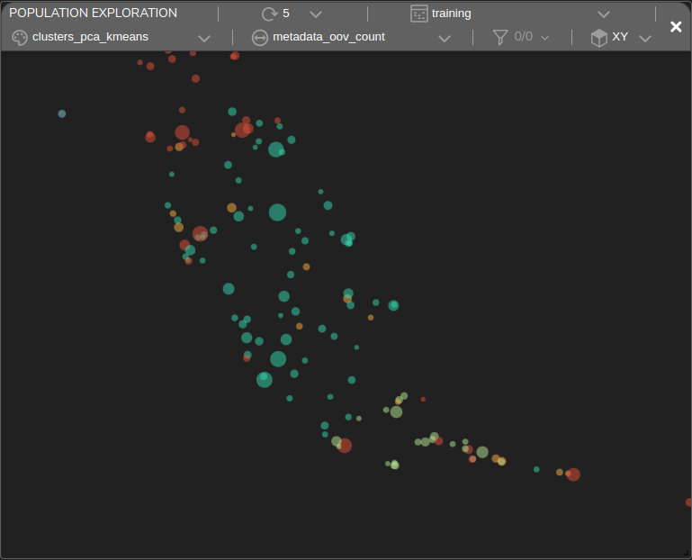
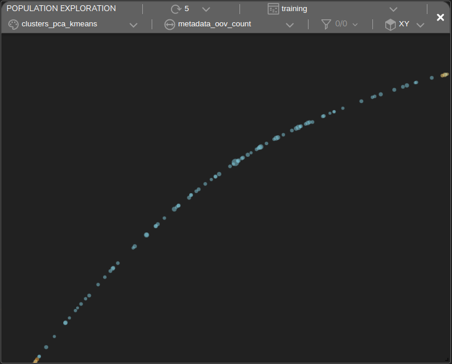

# Sentiment Analysis

## The IMDB Dataset

The **IMDB** dataset is one of the most popular sentiment analysis datasets. It contains multiple movie reviews, each annotated with either a `positive` or `negative` label.

In this example, a classifier model was built to predict positive and negative reviews.

### Text Preprocessing

To preprocess the text, first lowercase all words and remove any HTML residues and punctuations. Tokenize the words and feed them into an **Embedding** layer to embed all the tokens.

### Densely Connected Model

A straightforward approach to solving this problem is by using a densely connected model. The proposed [model](https://github.com/tensorleap/tensorleap/blob/master/examples/imdb/imdb/imdb/model_infer.py) is composed from a `Dense` layer followed by a `GlobalAveragePooling1D`.

Below is the model's block representation within our platform:


#### Training Metrics

During the training our platform collects various performance metrics and metadata that are presented interactively within a customizable Dashboard. This enables further performance and data analysis.\
After training the model for 20 epochs, the **accuracy** is **0.9595** and the error **loss** is **0.149**. \
Visualization of the error loss / accuracy vs batch:


### Error Analysis

#### Population Exploration

The plot below is a **population exploration** plot. It represents a samples' similarity map based on the model's latent space, built using the extracted features from the trained model.

The samples shown below were taken from the **training set** and are colored based on their **ground truth** class. The dot's size represents the model's error loss for that specific sample. We can see that there is a clear separation of the samples based on their classes.There are also failing samples (large dots).


#### Unsupervised Clustering

Tensorleap's platform provides an unsupervised clustering of samples based on their similarities.

In our use-case we can see that this clustering technique was able to group together samples with common features. For example, in this Population Exploration plot, each cluster is colored, while the size of the dot represents the number accuracy each sample:


It can be seen that the left-side groups consist of samples with a known ground truth of "positive".
 


#----------------------------
#### Sample Analysis

The Tensorleap platform provides us with a way to further explore the model's response to specific data samples.

For example, performing **Sample Analysis** of one of the failing samples shows a **false-positive** prediction made by the model, with a heat-map overlay that scores the significance of each word to the `positive` prediction:

 (1).png>)

The heat-map highlighted words such as "**brilliant**", "**entertaining**", "**masterpiece**" which indeed translates positively. But when we review their context, we get "**mildly entertaining**", "**not... brilliant**", and "**masterpiece because of sympathy**", which resonates as negative.

The dense model makes its prediction using a single word context, which can lead to inaccurate sentiment analysis. To improve upon this, next we will evaluate a separate convolutional model.

#------------------------------------

### Bert model

Our second model is a pretrained Bert (Bidirectional Encoder Representations from Transformers) model.


#----------------------------------
#### Sample Analysis

Running **Sample Analysis** on the same sample, now with the new CNN model, results in a 67% improvement in the error loss. Below are the heat-maps correlated with the `positive` and `negative` outputs:

 (1).png>) .png>)

As expected, the convolutional model has a much wider context window, which results in the attention being spread over longer phrases. One result of this change is that "**entertaining**" is no longer an indication of a positive sentiment. In fact, the bigram "**entertaining mildly**" is now an indicator of a `negative` sentiment.

#--------------------------------------

#### Data Exploration

The Tensorleap's Dashboard enables you to see how your data is distributed across various features. Below is a dashboard showing 5 histogram vs loss of informative features:


Different correlation insights from this visualization:

- `out-of-vocabulary` - the more out-of-vocabulary words a review has, the higher its loss.
- `polarity` - an external (TextBlob) polarity analysis shows that sentences with neutral polarity have higher loss.

## Summary

The **Tensorleap** platform provides powerful tools for analyzing and understanding deep learning models. In this example, we presented only a few examples of the types of insights that can be gained using the platform.&#x20;


# Getting Started with Tensorleap Project

This quick start guide will walk you through the steps to get started with this example repository project.

## Prerequisites

Before you begin, ensure that you have the following prerequisites installed:

- **[Python](https://www.python.org/)** (version 3.7 or higher).
- **[Poetry](https://python-poetry.org/)**.
- **[Tensorleap](https://tensorleap.ai/)** platform access. To request a free trial click [here](https://meetings.hubspot.com/esmus/free-trial).
- **[Tensorleap CLI](https://github.com/tensorleap/leap-cli)**.


## Tensorleap **CLI Installation**

with `curl`:

```
curl -s https://raw.githubusercontent.com/tensorleap/leap-cli/master/install.sh | bash
```

## Tensorleap CLI Usage

### Tensorleap **Login**

To login to Tensorleap:

```
tensorleap auth login [api key] [api url].
```

- API Key is your Tensorleap token (see how to generate a CLI token in the section below).
- API URL is your Tensorleap environment URL: https://api.CLIENT_NAME.tensorleap.ai/api/v2

<br>

**How To Generate CLI Token from the UI**

1. Login to the platform in 'CLIENT_NAME.tensorleap.ai'
2. Scroll down to the bottom of the **Resources Management** page, then click `GENERATE CLI TOKEN` in the bottom-left corner.
3. Once a CLI token is generated, just copy the whole text and paste it into your shell.


## Tensorleap **Project Deployment**

To deploy your local changes:

```
leap project push
```

### **Tensorleap files**

Tensorleap files in the repository include `leap_binder.py` and `leap.yaml`. The files consist of the  required configurations to make the code integrate with the Tensorleap engine:

**leap.yaml**

leap.yaml file is configured to a dataset in your Tensorleap environment and is synced to the dataset saved in the environment.

For any additional file being used, we add its path under `include` parameter:

```
include:
    - leap_binder.py
    - IMDb/configs.py
    - [...]
```

**leap_binder.py file**

`leap_binder.py` configures all binding functions used to bind to Tensorleap engine. These are the functions used to evaluate and train the model, visualize the variables, and enrich the analysis with external metadata variables

## Testing

To test the system we can run `leap_test.py` file using poetry:

```
poetry run test
```

This file will execute several tests on leap_binder.py script to assert that the implemented binding functions: preprocess, encoders,  metadata, etc.,  run smoothly.

*For further explanation please refer to the [docs](https://docs.tensorleap.ai/)*
