# ARMBench Segmentation

> **Note**: The dataset used in this project is not public, access to it can be granted by request.
> see this link: [ARMBench dataset](http://armbench.s3-website-us-east-1.amazonaws.com/index.html).
<br>
> After downloading the dataset it must be placed in a `armbench-segmentation/armbench_segmentation/dataset` folder

## General
This quick start guide will walk you through the steps to get started with this example repository project.

**Prerequisites**

Before you begin, ensure that you have the following prerequisites installed:

- **[Python](https://www.python.org/)** (version 3.8 or higher)
- **[Poetry](https://python-poetry.org/)**

### Tensorleap **CLI Installation**

with `curl`:

```
curl -s <https://raw.githubusercontent.com/tensorleap/cli-go/master/install.sh> | bash
```

with `wget`:

```
wget -q -O - <https://raw.githubusercontent.com/tensorleap/cli-go/master/install.sh> | bash
```

CLI repository: https://github.com/tensorleap/cli-go

### Tensorleap CLI Usage

#### Tensorleap **Login**
To allow connection to your Tensorleap platform via CLI you will have to authenticate and login.
To login to Tensorealp:

```
tensorleap auth login [api key] [api url].
```

- API Key is your Tensorleap token (see how to generate a CLI token in the section below).
- API URL is your Tensorleap environment URL: CLIENT_NAME.tensorleap.ai

<br>

**How To Generate CLI Token from the UI**

1. Login to the platform in 'CLIENT_NAME.tensorleap.ai'
2. Scroll down to the bottom of the **Resources Management** page, then click `GENERATE CLI TOKEN`  in the bottom-left corner.
3. Once a CLI token is generated, just copy the whole text and paste it into your shell:

```
tensorleap auth login [api key] [api url]
```

### Tensorleap Dataset Deployment

To deploy your local changes:

```
tensorleap datasets save
```

#### **Tensorleap files**

Tensorleap files in the repository include `leap_binder.py` and `.tensorleap.yaml`. The files consist of the  required configurations to make the code integrate with the Tensorleap engine:

**.tensorleap.yaml**

.tensorleap.yaml file is configured to a dataset in your Tensorleap environment and is synced to the dataset saved in the environment.

For any additional file being used we add its path under `include` parameter:

```
include:
  - leap_binder.py
  - armbench_segmentation/metrics.py
  - [...]
```

### **leap_binder.py file**
`leap_binder.py` configure all binding functions used to bind to Tensorleap engine. These are the functions used to evaluate and train the model, visualize the variables, and enrich the analysis with external metadata variables

### Testing

To test the system we can run `test_tensorleap.py` file using poetry:

```
poetry run test
```

This file will execute several tests on [the leap_binder.py](http://leap_binder.py) script to assert that the implemented binding functions: preprocess, encoders,  metadata, etc,  run smoothly.

*For further explanation please refer to the [docs](https://docs.tensorleap.ai/)*

## Project Description
### Dataset
The relevant dataset for this example is the `mix-object-tot` subset.
<br>
>**Mix-Object-Tote (14G)**: This subset consists of close-up images of mixed objects that are stored in either yellow or blue totes. Mix-Object-Tote comprises a total of 44,253 images of size 2448 by 2048 pixels and 467,225 annotations, with an average of 10.5 instances per tote.
<br>
>
We used a subset of 3000 images from the `mix-object-tote` and split them into train, validation and unlabeled datasets, each with 1000 images

<div style="display: flex; justify-content: center;">
    <div style="margin-right: 10px;">
        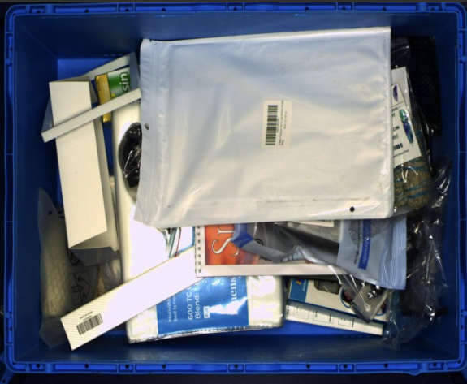
    </div>
    <div>
        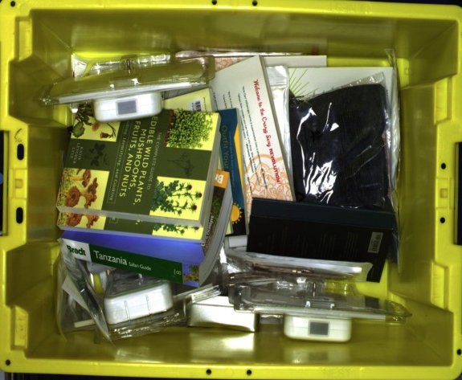
    </div>
    <div>
        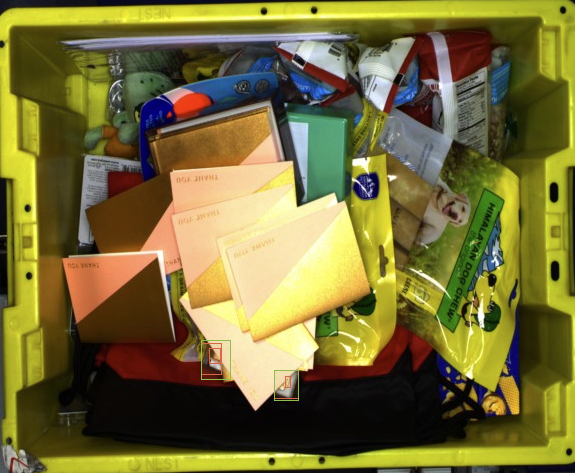
    </div>
</div> <br>

> **Note**: for now this project is limited to 3000 samples

### Model
The model used to predict both bounding boxes and segmentation masks is `YOLOv5s`
We trained the model over 1000 samples with validation set of another 1000 samples


### Latent Space Exploration
The following plot illustrates a population exploration map, depicting the similarity among samples based on the latent
space of a trained model. This map is constructed using the extracted features of the model.
Each sample is represented by a dot. The dots color and size is corresponding to the sample loss

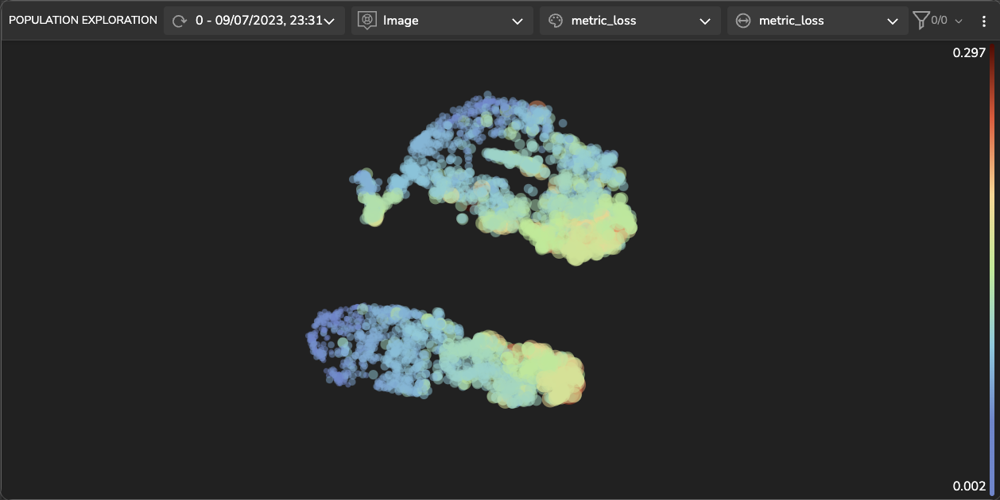

### Data Labeling & Dataset Pruning
#### Labeling
One of our dataset splits is unlabeled data. Labeling data is an expensive process, and we aim to choose the minimal subset of unlabeled images to label.
<br>
We can look at areas in which the model tends to fail and choose to label new data only in those regions of the latent space
> **Example**: The blue rectangles mark areas in wich the model tend to perform well and there is no point adding new similar samples.
<br>
> We would prefer to label new samples in the areas marked by the red rectangle in which the loss is relatively high (larger dots)
<br>
> 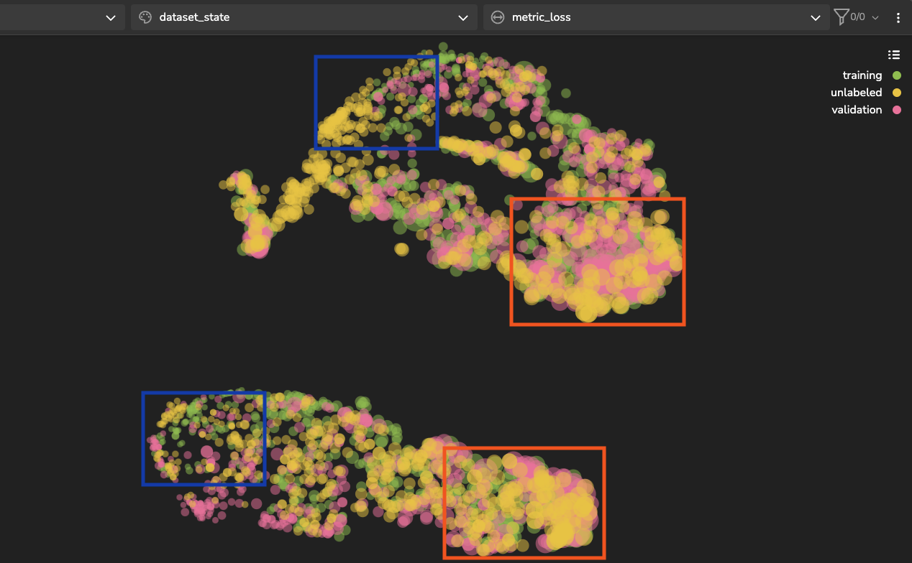

#### Pruning
In order to cut down training resources we would like to prune our dataset without hurting performances.
<br>
We can do that by examining clusters in which the model perform well and keep only some percentage of them.
<br>
TL allows you to do this with a few simple steps:
1. choose a cluster to examine, there are several clustering options to choose from.
2. Set a threshold for the distance from the cluster center. Samples in the center holds less information than sample far away.
3. Check the subgroups within the cluster. The samples in each subgroup hold similar information.
4. Sample from each subgroup to keep all relevant information with smaller amount of samples.

<div style="display: flex; justify-content: center;">
    <div style="margin-right: 10px;">
        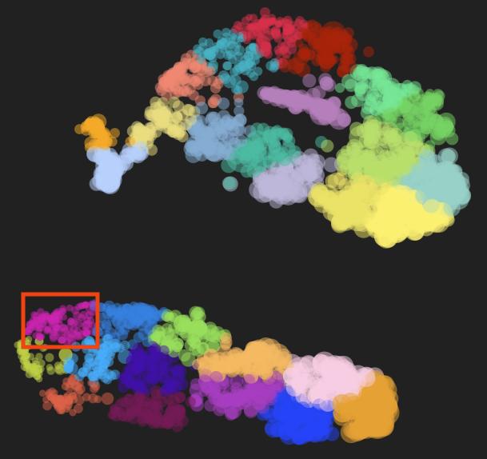
        <p>latent space colored by tsne clusters, we will focus on the cluster in the red rectangle</p>
    </div>
</div> <br><br>
<div style="display: flex; justify-content: center;">
    <div style="margin-right: 10px;">
        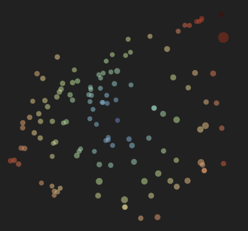
        <p>1) cluster's samples colored by the distance from the cluster center</p>
    </div>
    <div>
        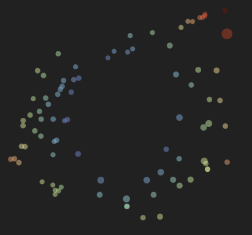
        <p>2) same as (1) but filtered by distance larger than 2</p>
    </div>
    <div>
        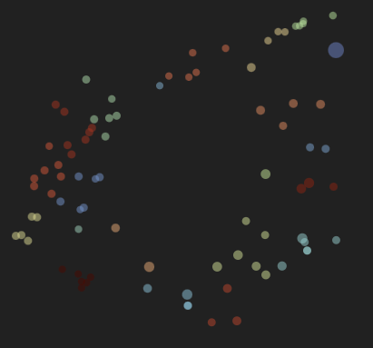
        <p>3) cluster's samples colored by the distance from the cluster center</p>
    </div>
</div> <br>

### Over & Under Segmentation Error Detection
Two types of model errors were over and under segmenting an object. this errors are defined as follows:
> **Under Segmentation** - the detection of multiple objects as one object i.e., joining bounding boxes /masks into one.
<br>

> **Over Segmentation** - the detection of one object as multiple objects i.e., dividing bounding boxes/ masks into multiples.

We defined metrics and visualizers for each error type and we were able to get insights on clusters that tends to fail on those errors
<br>
and visualize them for further analysis

#### Under Segmentation Examples
<div style="display: flex; justify-content: center;">
    <div style="margin-right: 10px;">
        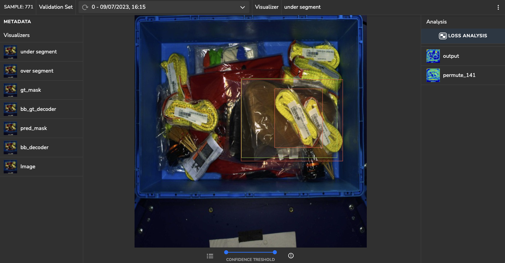
    </div>
    <div>
        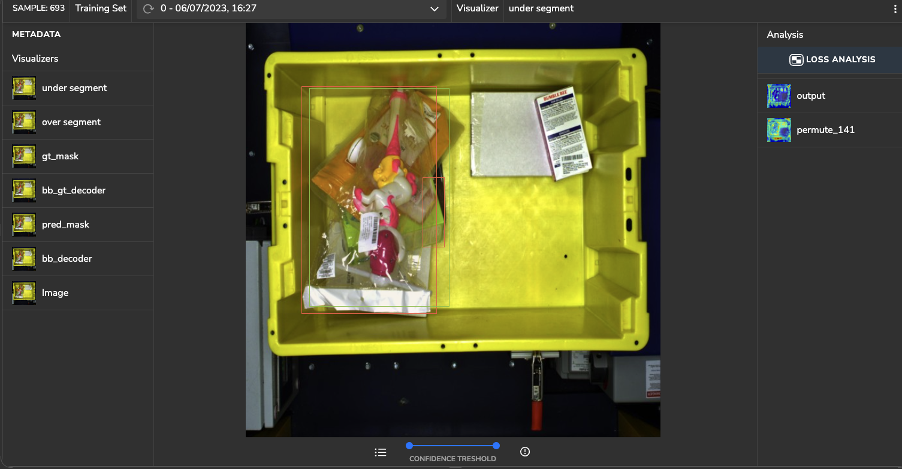
    </div>
</div> <br>

#### Over Segmentation Example
<div style="display: flex; justify-content: center;">
    <div style="margin-right: 1px;">
        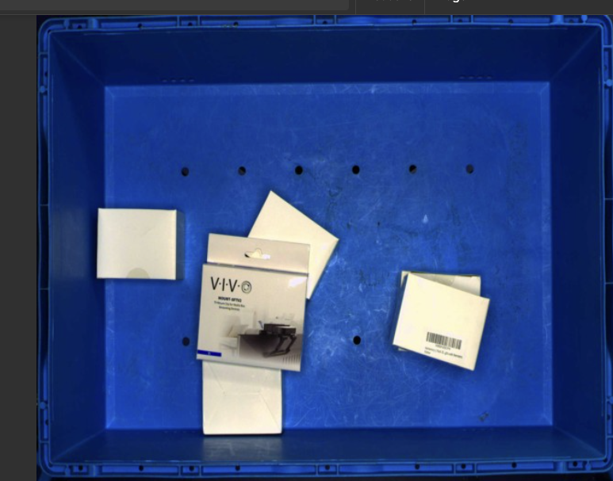
        <p>1) original image</p>
    </div>
    <div>
        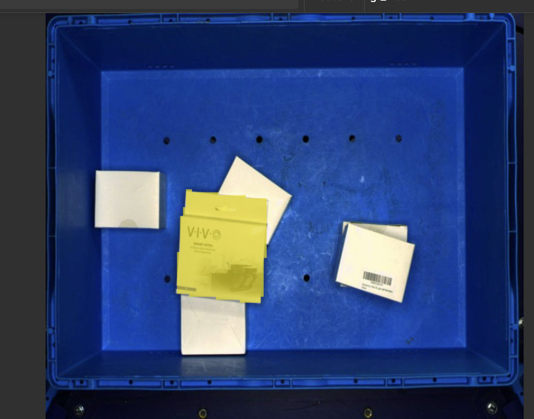
        <p>2) ground truth mask</p>
    </div>
    <div>
        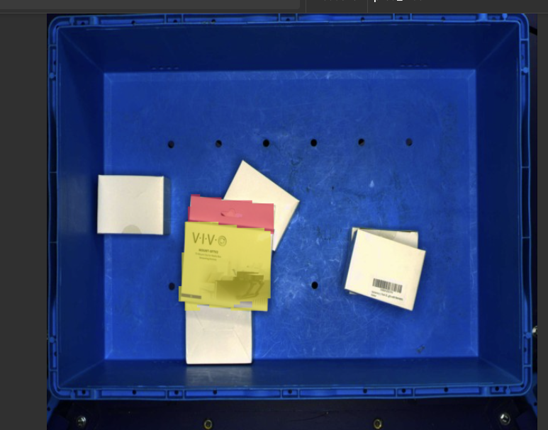
        <p>3) predicted masks</p>
    </div>
</div> <br>
