# Resnet18 model with CIFAR-10 dataset

This project utilizes the [Resnet18]() algorithm to perform image classification on the [CIFAR-10]() dataset. The 
CIFAR-10 dataset comprises 60,000 32x32 color images distributed across 10 classes, with each class containing 6,000 
images. The ground truth labels for the classes are as follows: 'airplane', 'automobile', 'bird', 'cat', 'deer', 'dog', 
'frog', 'horse', 'ship', and 'truck'.

## Latent Space Exploration

The following plot illustrates a population exploration map, depicting the similarity among samples based on the latent 
space of a trained model. This map is constructed using the extracted features of the model.

The visualization show the all the data points, revealing two distinct clusters. These clusters represent images labeled 
as animals or vehicles according to their ground truth labels. The noticeable separation between the clusters indicates 
a significant difference between these two categories.

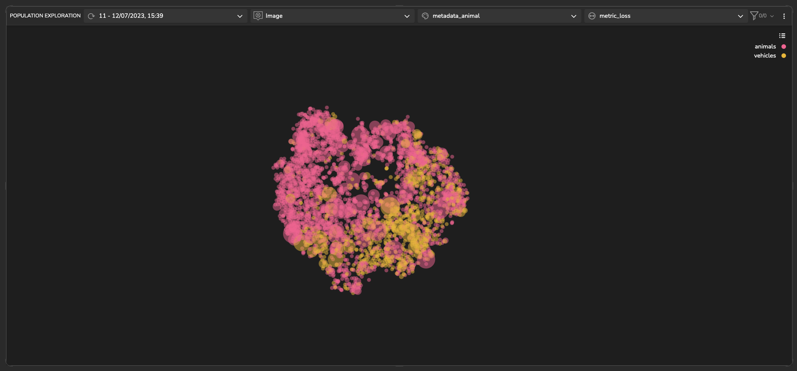

### *Detecting & Handling High Loss Clusters*

After conducting further analysis, it has been observed that the 'cat' cluster consists of several samples with higher 
loss, indicated by larger dot sizes on the plot. A closer examination reveals that a significant number of these samples 
were incorrectly predicted as 'dog' by the model. This suggests that there is a need to include more images of cats and 
possibly dogs in the training dataset to improve the model's ability to recognize them accurately.

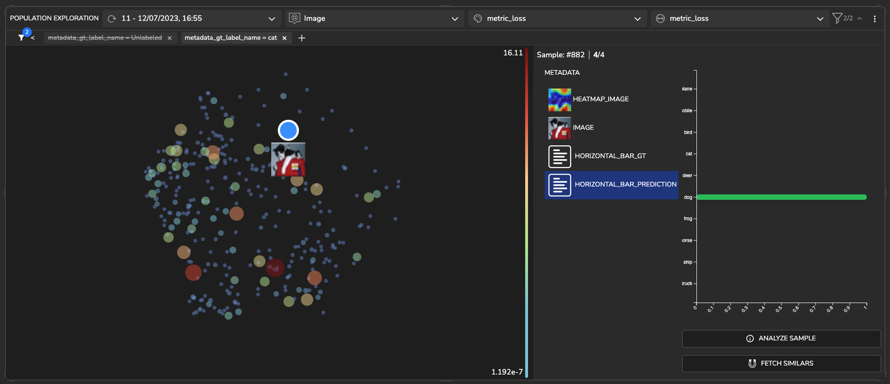

### *Detecting & Handling High Loss Unlabeled Clusters* 

In the k-means clusters, clusters 5 and 2 are observed to be in proximity to each other. Cluster 5 predominantly 
consists of images with a light background and objects exhibiting an orange shade. On the other hand, cluster number 2 
also has a light background, but the objects within it appear in a darker shade.

#### *<u>- cluster 5: </u>* 

  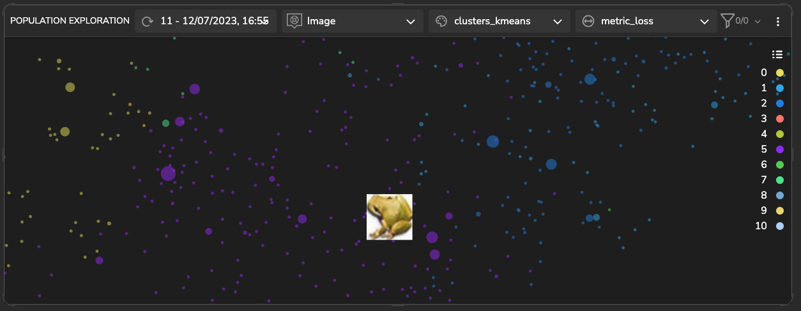
  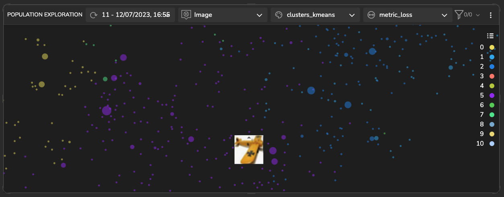

 

#### *<u>- cluster 2: </u>* 

  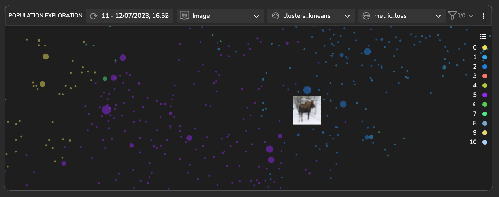
  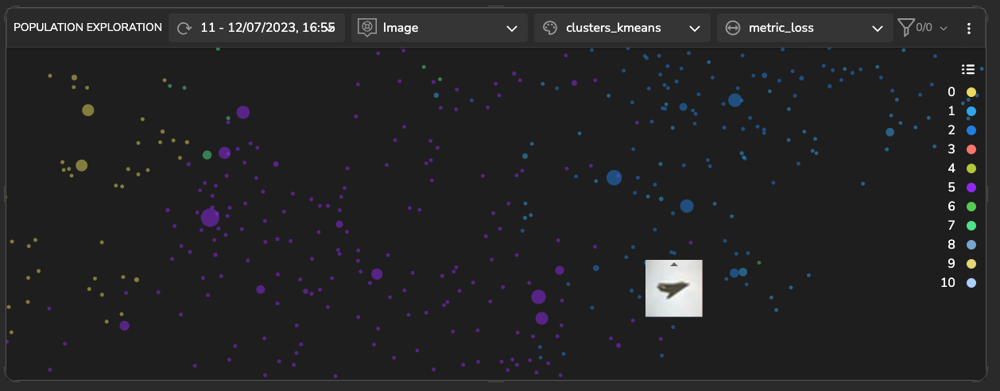

#### fetching similar

An alternative method for identifying clusters in the model's latent space is to retrieve similar samples based on a 
selected sample. This approach allows you to pinpoint a cluster that exhibits a specific intrinsic property of interest. 
The figure presented below illustrates such a cluster, comprising images that feature animal faces captured from a 
profile perspective.

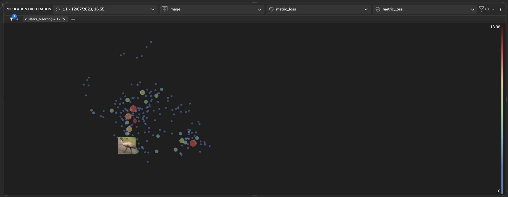
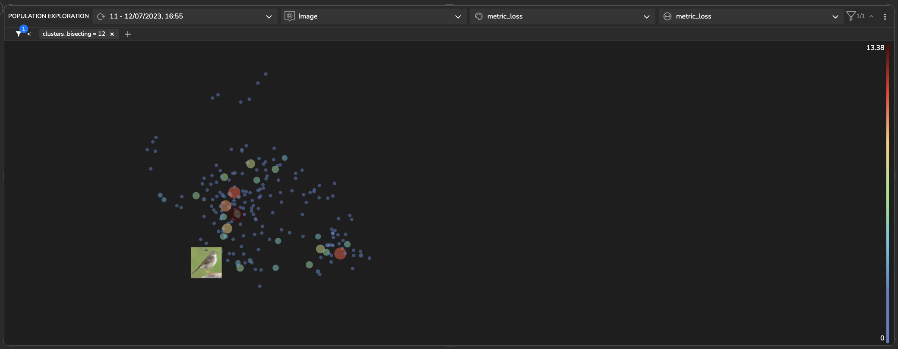

## Sample Loss Analysis

Within this section, we delve into the examination of features that impact the model's predictions. Through the 
identification and extraction of the most influential features, as well as assessing the derivatives of the loss 
function in relation to the activation maps, we gain insights into the specific contributions of informative features 
towards the overall loss. Based on this analysis, a heatmap is generated to visually represent the relevant information 
derived from these features.

In the image depicted below, it is evident that the presence of background features leads to a higher loss function. 
Conversely, the inclusion of features in the nose area contributes to a lower loss function, which signifies the image's 
classification as a cat.

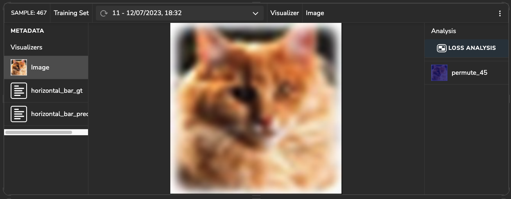
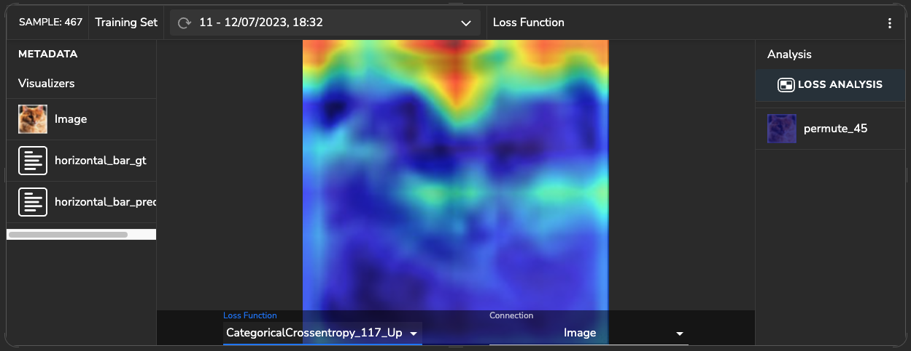
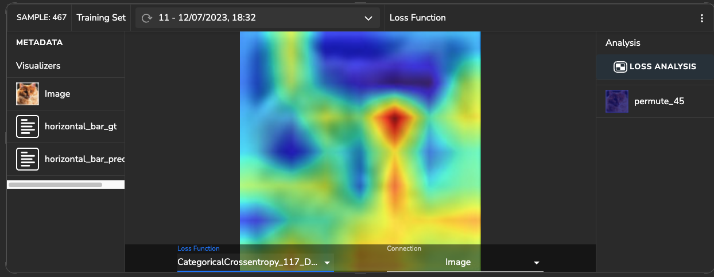

