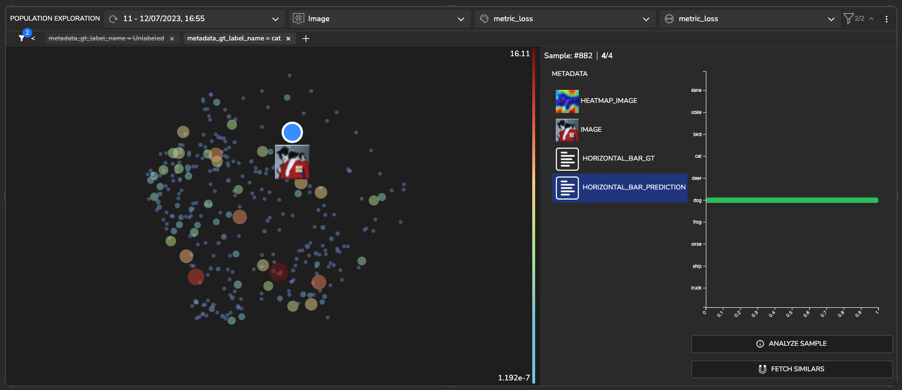
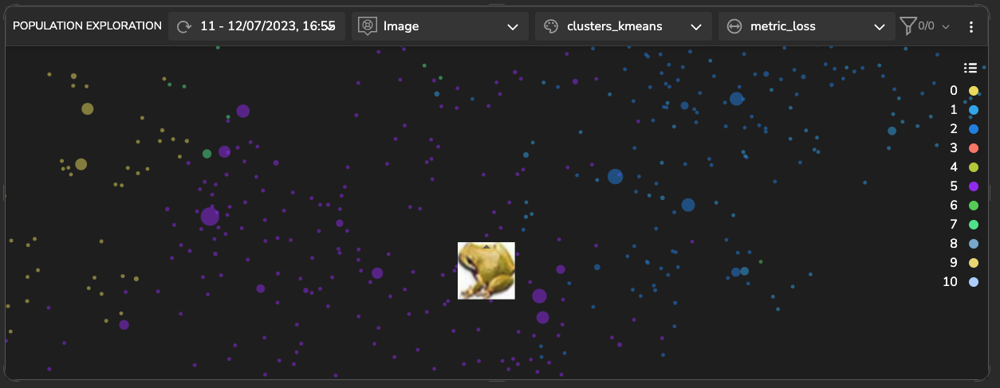
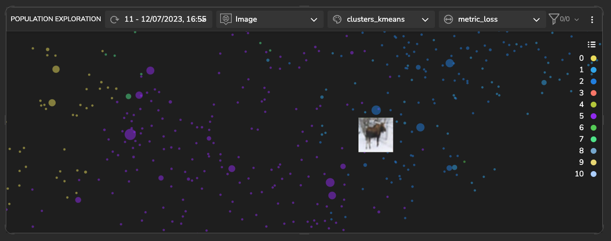
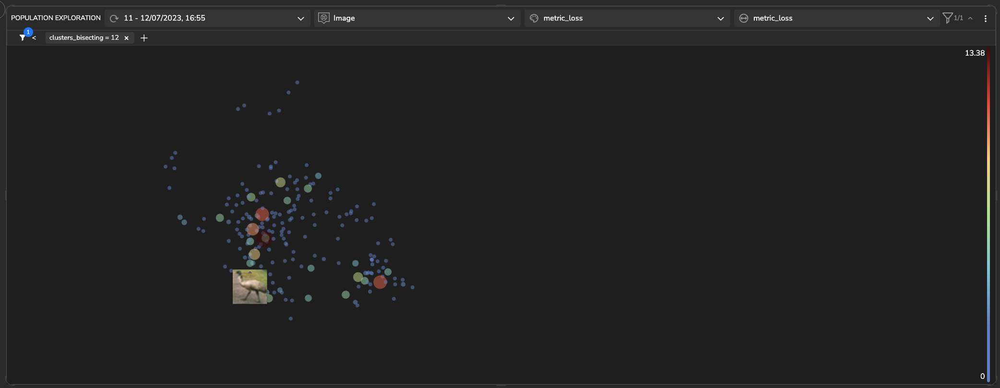

# Resnet18 model with CIFAR-10 dataset

This project utilizes the Resnet18 model to perform image classification on the 
[CIFAR-10](https://www.cs.toronto.edu/~kriz/cifar.html) dataset. The 
CIFAR-10 dataset comprises 60,000 32x32 color images distributed across 10 classes, with each class containing 6,000 
images. 

Using **Tensorleap** we can save time while exploring and detecting high loss and or unlabeled clusters and samples.

### Latent Space Exploration

The following plot illustrates a population exploration map, depicting the similarity among samples based on the latent 
space of a trained model. This map is constructed using the extracted features of the model.

The visualization shows all the data points, revealing two distinct clusters. These clusters represent images labeled 
as animals or vehicles according to their ground truth labels. The noticeable separation between the clusters indicates 
a significant difference between these two categories.


#### *Detecting & Handling High Loss Clusters*

After conducting further analysis, it has been observed that the 'cat' cluster consists of several samples with higher 
loss, indicated by larger dot sizes on the plot. A closer examination reveals that a significant number of these samples 
were incorrectly predicted as 'dog' by the model. This suggests that there is a need to include more images of cats and 
possibly dogs in the training dataset to improve the model's ability to recognize them accurately.




#### *Detecting & Handling High Loss Unlabeled Clusters* 

In the k-means clusters, clusters 5 and 2 are observed to be in proximity to each other. Cluster 5 predominantly 
consists of images with a light background and objects exhibiting an orange shade. On the other hand, cluster number 2 
also has a light background, but the objects within it appear in a darker shade.

##### *<u>- cluster 5: </u>* 
<div style="display: flex">
  
  
</div> 

##### *<u>- cluster 2: </u>* 

<div style="display: flex">
  
  
</div>


##### fetching similar

An alternative method for identifying clusters in the model's latent space is to retrieve similar samples based on a 
selected sample. This approach allows you to pinpoint a cluster that exhibits a specific intrinsic property of interest. 
The figure presented below illustrates such a cluster, comprising images that feature animal faces captured from a 
profile perspective.





### Sample Loss Analysis

Within this section, we delve into the examination of features that impact the model's predictions. 
Tensorleap automatically generates a heatmap that quantifies the effect different features have on the loss. 

In the image depicted below, it is evident that the presence of background features leads to a higher loss function. 
Conversely, the inclusion of features in the nose area contributes to a lower loss function, which signifies the image 
classification as a cat.


# Getting Started with Tensorleap Project

This quick start guide will walk you through the steps to get started with this example repository project.

## Prerequisites

Before you begin, ensure that you have the following prerequisites installed:

- **[Python](https://www.python.org/)** (version 3.7 or higher).
- **[Poetry](https://python-poetry.org/)**.
- **[Tensorleap](https://tensorleap.ai/)** platform access. To request a free trial click [here](https://meetings.hubspot.com/esmus/free-trial).
- **[Tensorleap CLI](https://github.com/tensorleap/leap-cli)**.


## Tensorleap **CLI Installation**

with `curl`:

```
curl -s https://raw.githubusercontent.com/tensorleap/leap-cli/master/install.sh | bash
```

## Tensorleap CLI Usage

### Tensorleap **Login**

To login to Tensorleap:

```
tensorleap auth login [api key] [api url].
```

- API Key is your Tensorleap token (see how to generate a CLI token in the section below).
- API URL is your Tensorleap environment URL: https://api.CLIENT_NAME.tensorleap.ai/api/v2

<br>

**How To Generate CLI Token from the UI**

1. Login to the platform in 'CLIENT_NAME.tensorleap.ai'
2. Scroll down to the bottom of the **Resources Management** page, then click `GENERATE CLI TOKEN` in the bottom-left corner.
3. Once a CLI token is generated, just copy the whole text and paste it into your shell.


## Tensorleap **Project Deployment**

To deploy your local changes:

```
leap project push
```

### **Tensorleap files**

Tensorleap files in the repository include `leap_binder.py` and `leap.yaml`. The files consist of the  required configurations to make the code integrate with the Tensorleap engine:

**leap.yaml**

leap.yaml file is configured to a dataset in your Tensorleap environment and is synced to the dataset saved in the environment.

For any additional file being used, we add its path under `include` parameter:

```
include:
    - leap_binder.py
    - cifar10_resnet/configs.py
    - [...]
```

**leap_binder.py file**

`leap_binder.py` configures all binding functions used to bind to Tensorleap engine. These are the functions used to evaluate and train the model, visualize the variables, and enrich the analysis with external metadata variables

## Testing

To test the system we can run `leap_test.py` file using poetry:

```
poetry run test
```

This file will execute several tests on leap_binder.py script to assert that the implemented binding functions: preprocess, encoders,  metadata, etc.,  run smoothly.

*For further explanation please refer to the [docs](https://docs.tensorleap.ai/)*


