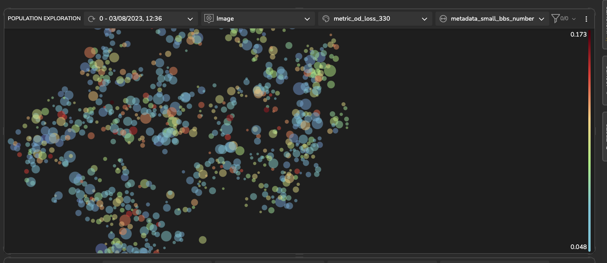
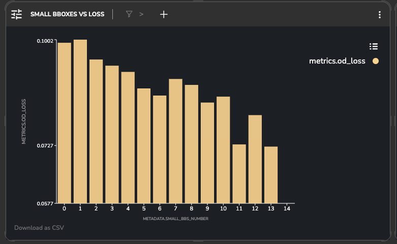
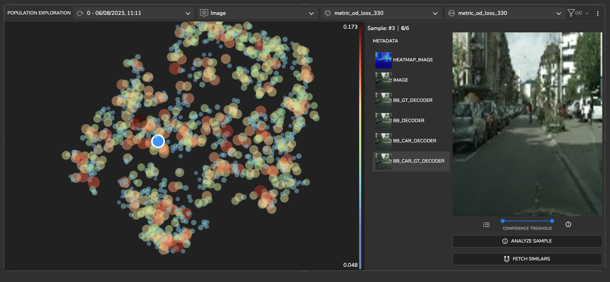
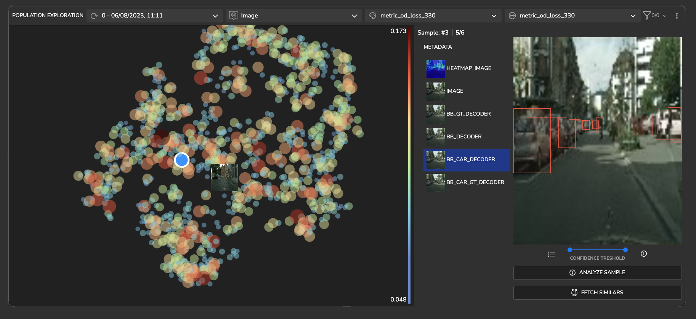
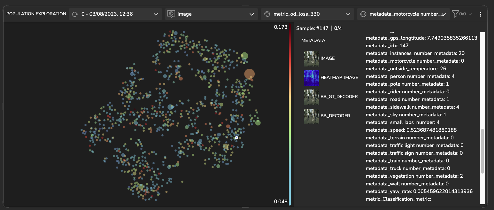
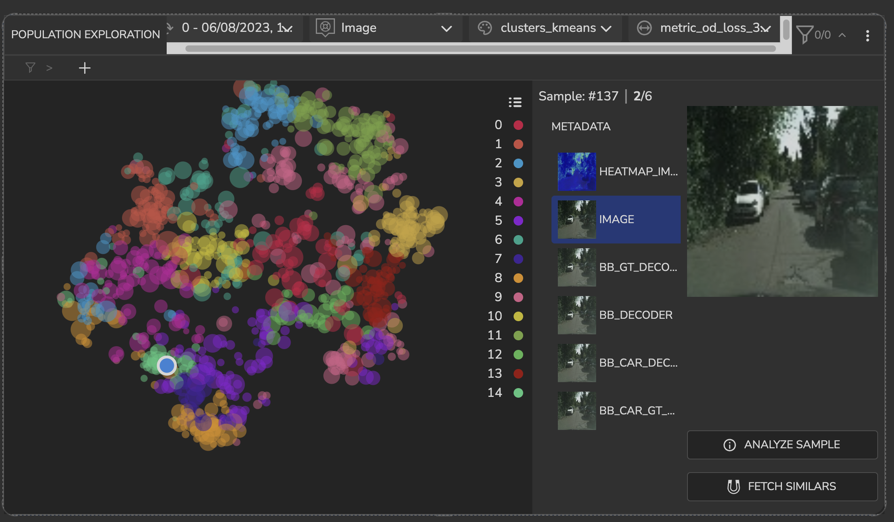
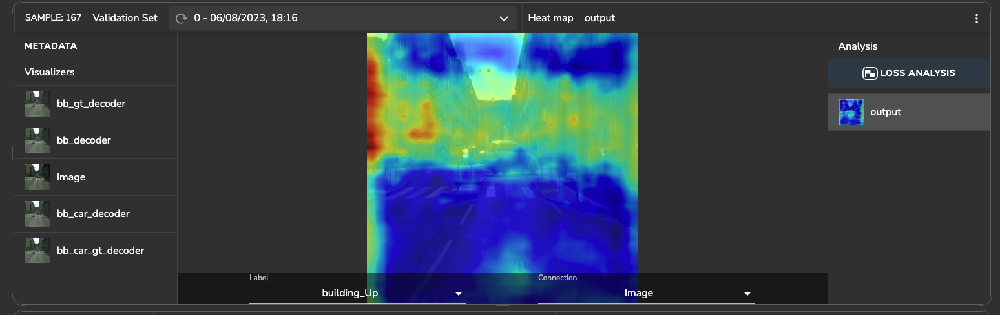
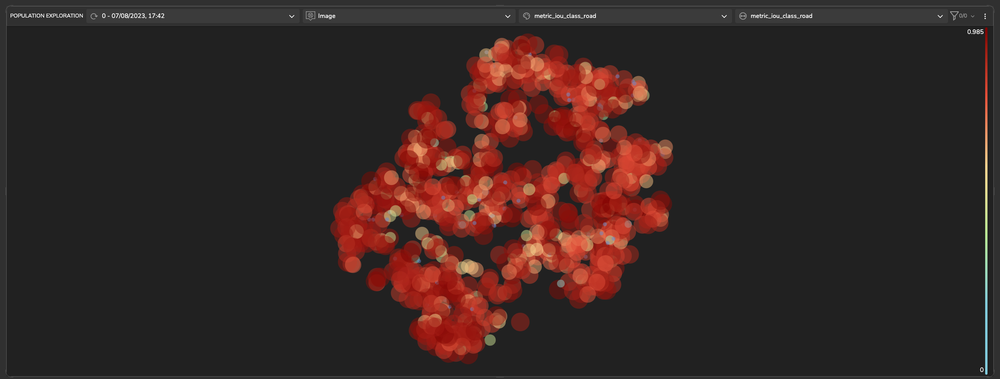

## Project Description
_____________________________________________
### YOLOv7 model with Cityscapes dataset

This project utilizes the [YOLOv7]() algorithm to perform object detection on [Cityscapes]() dataset. The 
cityscapes dataset is a large-scale dataset stands as one of the standard ADAS benchmarks used for multiple vision
related tasks.


### Latent Space Exploration
The following plot illustrates a population exploration map, depicting the similarity among samples based on the latent 
space of a trained model. This map is constructed using the extracted features of the model.

#### *Detecting & Handling High Loss Clusters*
Upon conducting additional analysis, it was found that when the number of small bounding boxes decreases, 
the object detection loss increases.

<div style="display: flex">
  
  
</div>

#### *Mislabeled data*

Upon conducting further analysis, it has been discovered that images containing cars exhibit a high loss. Subsequent 
research has revealed that the algorithm is actually recognizing cars accurately, but the ground truth (gt) labels are 
incorrect. The cars in the images are mislabeled. To address this issue, it is essential to correct the labels for the 
cars in order to improve the performance of the algorithm.

<div style="display: flex">
  
  
</div>

We can observe that the class "motorcycle" is underrepresented in the data. The majority of images have zero labeled 
ground truth bounding boxes for motorcycles. To address this, we should investigate if there are any mislabeling or 
consider adding more images containing motorcycles to improve the representation of this class in the dataset.




#### *Detecting Unlabeled Clusters*

Cluster number 14 of k-means clusters characterized in dark ambiance images, featuring a road surrounded by vegetation, 
while cars are the primary objects present in the image.



### Sample Loss Analysis

Within this section, we delve into the examination of features that impact the model's predictions. 
Tensorleap automatically generates a heatmap that quantifies the effect different features has on loss/ specific prediction.
In the image depicted below, the heat map displays warmer areas, indicating regions in the image where features are more
prominent, and thereby increasing the likelihood that the object in those areas is a building.



### IOU metric
After implementing the Intersection over Union (IoU) metric for each category's class_id, it becomes evident that the 
IoU scores for the 'road' category are consistently high across most of the images. This suggests that the model's 
performance in detecting and accurately segmenting the 'road' class is notably successful in many instances.



## General
This quick start guide will walk you through the steps to get started with this example repository project.

**Prerequisites**

Before you begin, ensure that you have the following prerequisites installed:

- **[Python](https://www.python.org/)** (version 3.8 or higher)
- **[Poetry](https://python-poetry.org/)**

### Tensorleap **CLI Installation**

with `curl`:

```
curl -s <https://raw.githubusercontent.com/tensorleap/leap-cli/master/install.sh> | bash
```

with `wget`:

```
wget -q -O - <https://raw.githubusercontent.com/tensorleap/leap-cli/master/install.sh> | bash
```

CLI repository: https://github.com/tensorleap/leap-cli

### Tensorleap CLI Usage

#### Tensorleap **Login**
To allow connection to your Tensorleap platform via CLI you will have to authenticate and login.
To login to Tensorealp:

```
leap auth login [api key] [api url].
```

- API Key is your Tensorleap token (see how to generate a CLI token in the section below).
- API URL is your Tensorleap environment URL: CLIENT_NAME.tensorleap.ai

<br> 

**How To Generate CLI Token from the UI**

1. Login to the platform in 'CLIENT_NAME.tensorleap.ai'
2. Scroll down to the bottom of the **Resources Management** page, then click `GENERATE CLI TOKEN`  in the bottom-left corner.
3. Once a CLI token is generated, just copy the whole text and paste it into your shell:

```
leap auth login [api key] [api url]
```

### Tensorleap Dataset Deployment

To deploy your local changes:

```
leap code push
```

### **Tensorleap files**

Tensorleap files in the repository include `leap_binder.py` and `leap.yaml`. The files consist of the  required
configurations to make the code integrate with the Tensorleap engine:

### **leap.yaml file**
leap.yaml file is configured to a dataset in your Tensorleap environment and is synced to the dataset saved in the environment.

For any additional file being used we add its path under `include` parameter:

```
include:
    - leap_binder.py
    - cityscapes_od/data/preprocess.py
    - cityscapes_od/utils/gcs_utils.py
    - cityscapes_od/utils/general_utils.py
    - cityscapes_od/utils/yolo_utils.py
    - cityscapes_od/config.py
    - cityscapes_od/metrics.py
    - cityscapes_od/od_config.yaml
    - cityscapes_od/plots.py
    - cityscapes_od/visualizers.py

```

### **leap_binder.py file**
`leap_binder.py` configure all binding functions used to bind to Tensorleap engine. These are the functions used to 
evaluate and train the model, visualize the variables, and enrich the analysis with external metadata variables

### Testing

To test the system we can run `leap_test.py` file using poetry:

```
poetry run test
```

This file will execute several tests on [the leap_binder.py] script to assert that the implemented binding functions: 
preprocess, encoders,  metadata, etc,  run smoothly.

*For further explanation please refer to the [docs](https://docs.tensorleap.ai/)*


