# README

## Semantic Segmantation - COCO 

In this example, we show the use of Tensorleap on a Computer Vision task - Semantic Segmentation on COCO data. We use `coco 14` training and validation data files combined with a `mobilenet_v2` backbone and a `pix2pix` based decoder. 

### The Task

The goal of Semantic Segmentation is to label each pixel of an image with a corresponding class. Because the prediction is for every pixel in the image, this task is commonly referred to as dense prediction. In Semantic Segmentation, the boundary of objects is labeled with a mask, and object classes are labeled with a class label. The output itself is a high-resolution image (typically of the same size as the input image) in which each pixel is classified to a particular class. 

### The Dataset

COCO (Common Objects in Context) is large-scale object detection, segmentation, and captioning dataset. The COCO Dataset has 80 classes.

### The Model

#### Model Introduction

We use a modified U-Net, which is an end-to-end Fully Convolutional Network Model for the task. The U-Net was developed by Olaf Ronneberger et al. for Biomedical Image Segmentation. The architecture consists of an encoder - which is used to capture the image context, and a decoder - which is used to enable precise localization using transposed convolutions. 

In the original paper, the U-Net is described as follows:

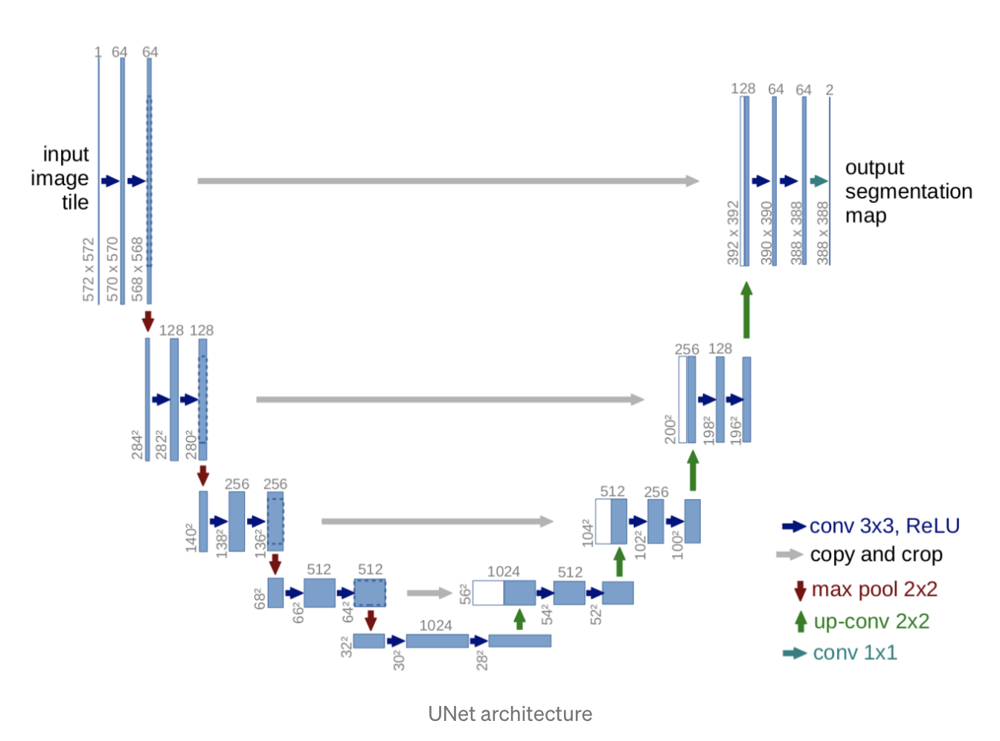

#### Transfer Learning

For the encoder, we use a pre-trained model - MobileNetV2. That will help to learn robust features and reduce the number of trainable parameters. The decoder/upsampler is simply a series of upsample blocks. During the training process, only the decoder is being trained when the encoder weights are being frozen.

## Category Prediction Model

The model's task is to segment images consisting of two categories: `person` and `car`.  

First, we evaluate our model on a dataset subset containing cars and person instances:

| Dataset        | Mean IoU Person |
|----------------|-----------------|
| Category Model | 0.309           |

#### Cluster Analysis

To qualitatively analyze the model's predictions on the different classes we utilize Tesnorleap's latent space. We select samples from different areas of the embedding space and use `fetch similar` to create unique clusters of similar samples.

Among the clusters we got are:

#### B&W cluster 

We fetch a group of similar images that are mostly greyscale images as seen below:

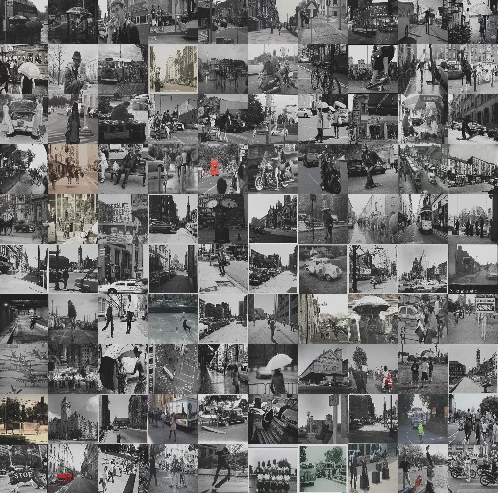

This cluster not only captures the single channel B&W images, but also those images with a small variation in
[hue](https://en.wikipedia.org/wiki/HSL_and_HSV).

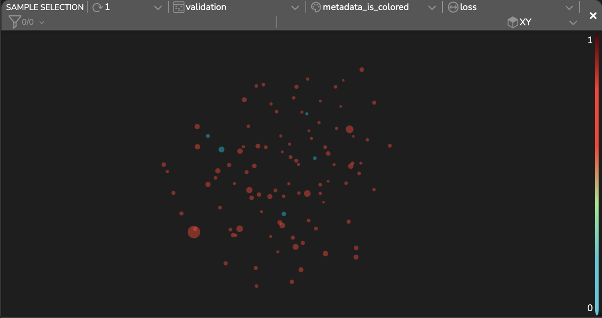

In fact, viewing the cluster in Tensorleap's `cluster analysis` shows that the vast majority of images (colored red) 3-channel RGB imagees.

If we compare B&W images to RGB images we see that, on average, our loss on RGB images is lower:

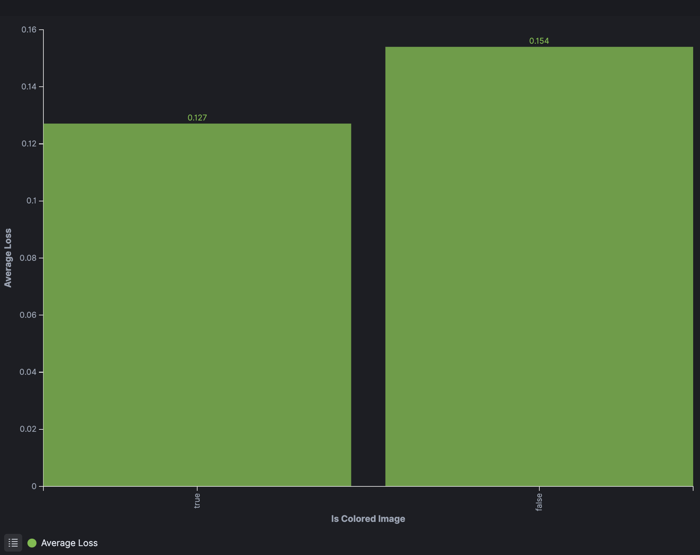

#### 'Vehicle-like' clusters
Our model latent space have multiple semantically meaningful vehicle clusters
#### Bicycle cluster 

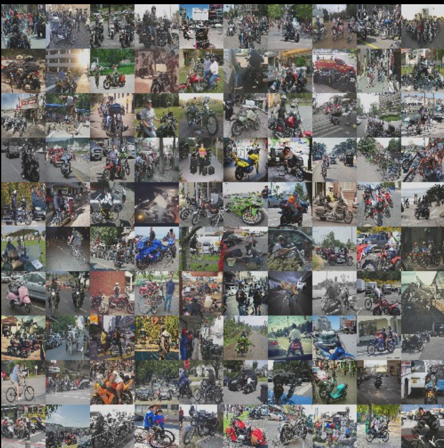

#### Bus cluster

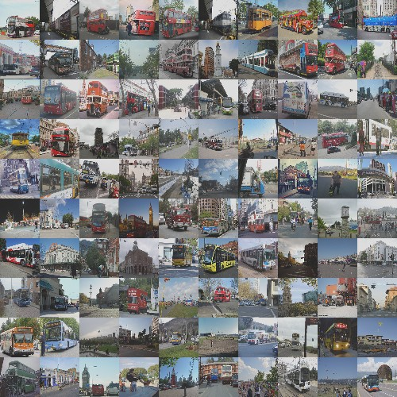

Suprisingly, the attention map that highlights the features that defines this custer contain not only bus feature, bus also buildings, towers, and similar constructs:

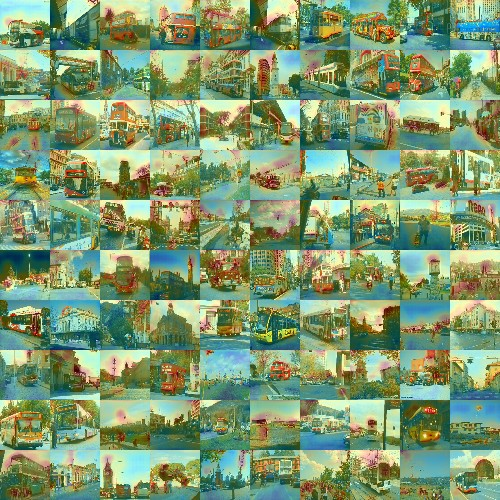

## Vehicle Supercategory Model

Our previous model tries to segment cars as a seperate class from truck & bus (which are labeled background). Often, we need to segment the entire vehicle SuperCategory (SC) together. Here, we train a SC model that tries to segment vehicles, person, and background.

To see how this new model latent space is effected we could examine its latent space by using cluster analysis. 

#### Cluster Analysis

`Fetching Similars` to one of the vehicles as expected result in a more homogenous cluster (composed of cars + buses).

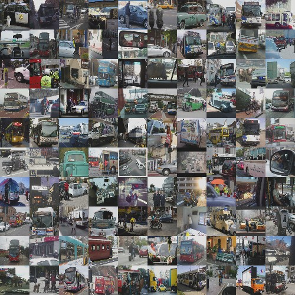

Our new model is now able to find strong, discriminative, features to this cluster - such as wheels:

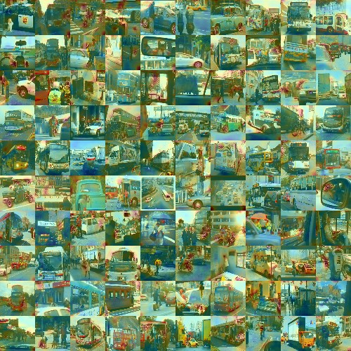

Reviewing the attention map reveals a possible confusion: round objects could be categorized as cars due to their similarity to wheels. We analyze one of the samples in this cluster to exemplify this issue. 
 
In the following figure we show a sample of a person holding a camera. While the GT is that of a person (bottom right) the actual prediction is that of a car (top right).  
This is due to the camera lens that provided features that supported a car class (top left) and associated the sample with the cluster (bottom left).

#### Effect on the person class

Using Tensorleap's population exploration we can compare the embedding of images with a high percent of car pixels to a high percent of people pixels, in the original model (top figures) and the new model (bottom figures):

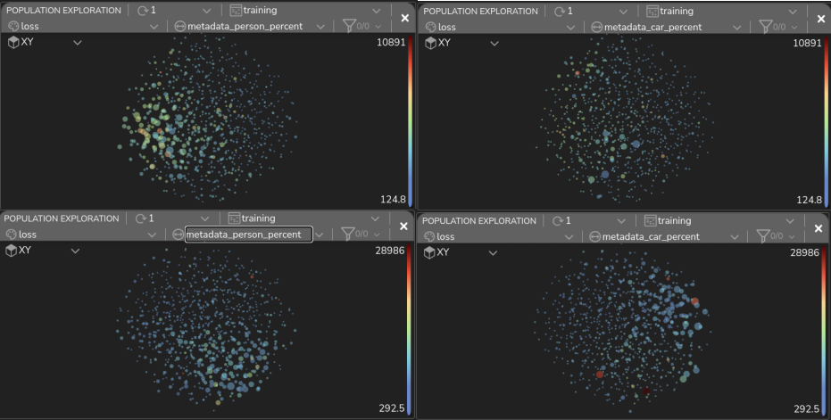

Since our new model is now able to use a wider collection of features to describe the vehicle category its latent
space provide better seperability between humans and vehicles, and is able to more accurately capture these two categories.

Thus, for example, when we examine the IOU on the person class we see that our SC model is more accurate than the original one:

| Dataset              | Mean IoU Person |
|----------------------|-----------------|
| Category Model       | 0.309           |
| Super Category Model | 0.319           |

#### Additional cluster: Sport cluster

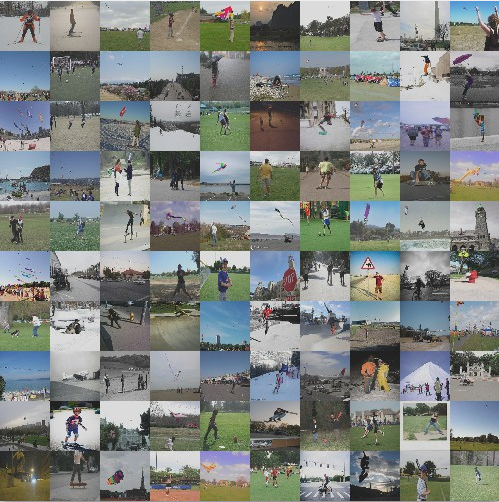

Our model is also able to use context to group images, as shown by this cluster containing sport activities.

#### False and Ambiguous Labels

With the help of the `Sample Analysis` feature, we can find some ambiguous labels and false labeling images that we can choose to exclude from our train dataset to improve the performance.

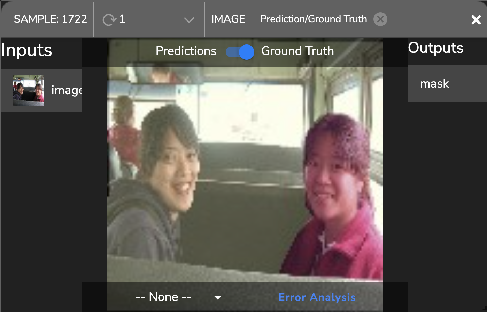       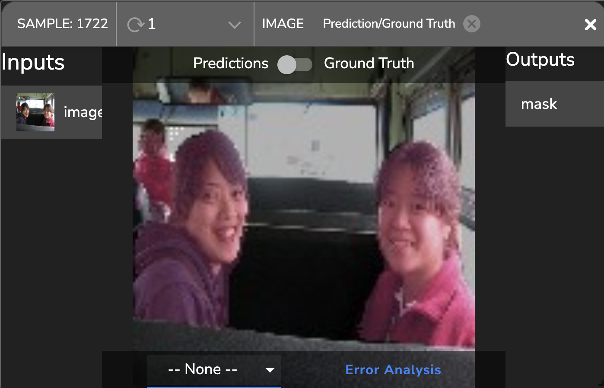
<figcaption> GT: Mislabeled Image: two missing people: - The driver and the woman from the left are segmented as the car. (from left). Prediction: the model correctly segments all three people (from right).
</figcaption>

- Sample error analysis revealed that it wasn't the model's false prediction on that sample but rather false labeling.  

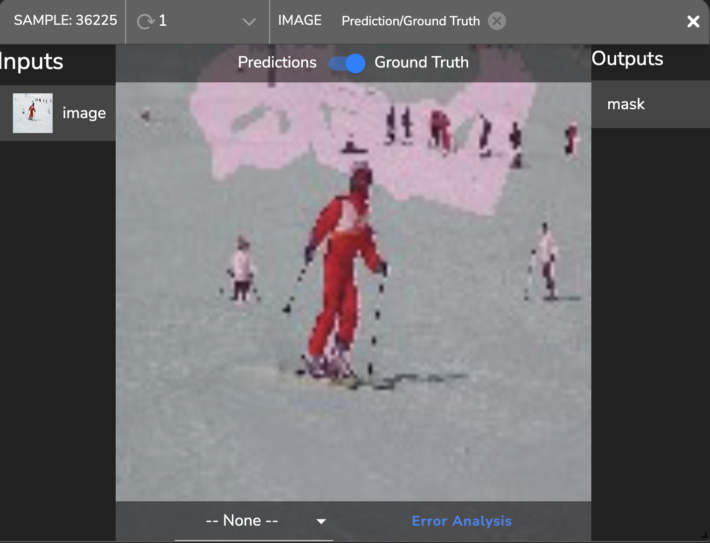  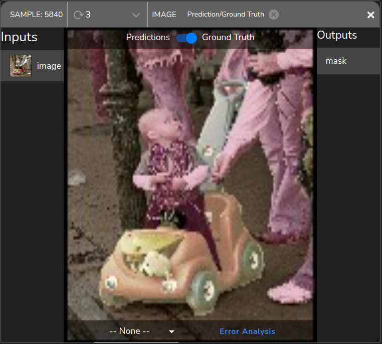 
<figcaption> Inaccurate GT (from left), and ambiguous label image: toy car as a car :) (from right). </figcaption> 

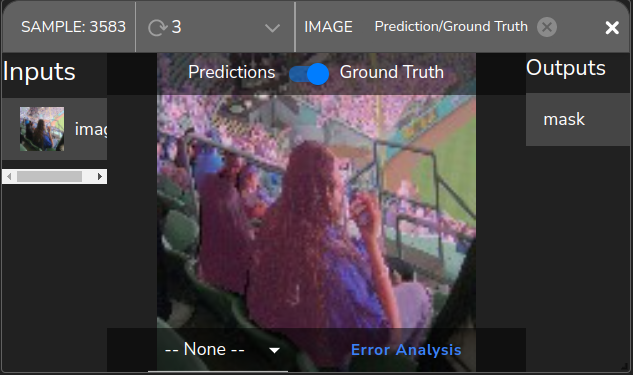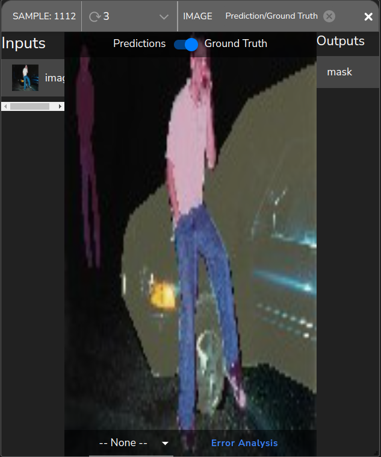
<figcaption> Challenging images: low light (from left), and crowds with small people (from right). </figcaption>

### Performance and Metadata Analysis

We can plot using Tensorleap the metadata we extract to identify trends and factors that are correlated to the performance. 

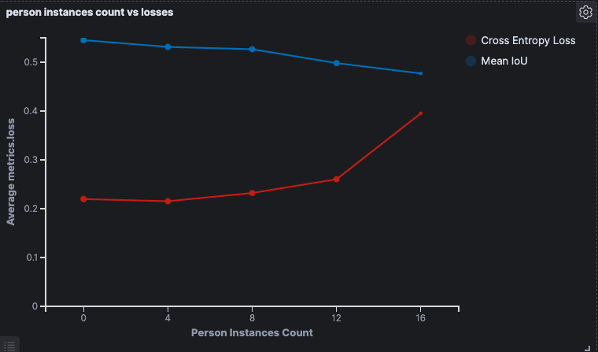 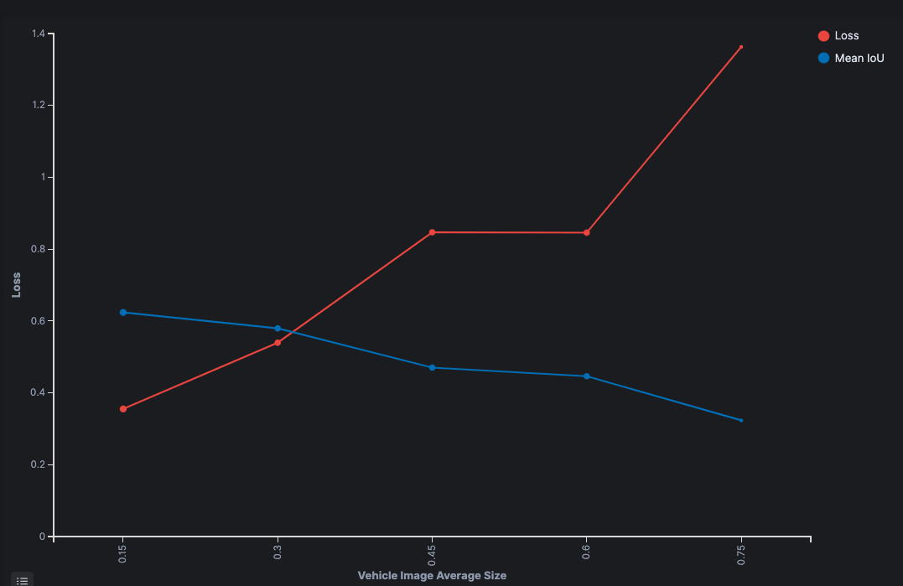

From the figure from left, we can see that when the number of person instances per image increases the Cross-Entropy Loss increases and the mean IoU decreases. The net's predictions are less accurate when the image is denser with objects.

For the vehicle category, we can see that model performance decreases when the vehicle average size increases (right figure).

#### Summary and Conclusion

We have shown how Tensorleap features can reveal mislabeled samples that may confuse the model during training, and metadata factors that affect the performance. All these insights can improve and significantly decrease the model optimization process.

