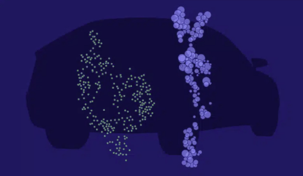
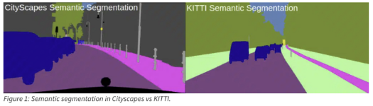
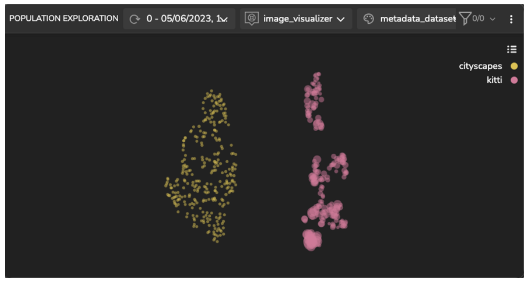
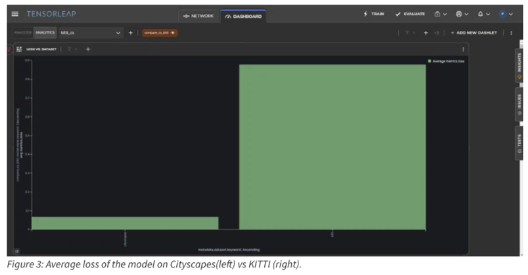
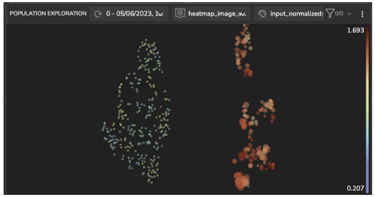
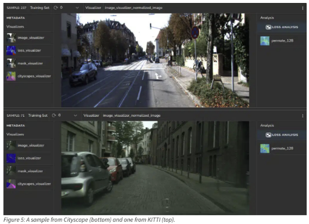
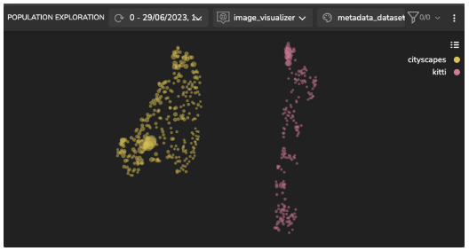
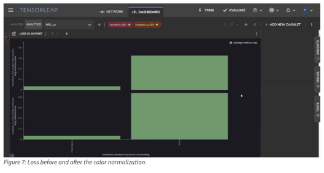

# Domain Gap



**Domain adaptation** is a technique in deep learning that reduces the difference between two datasets so that a model trained on one dataset can perform well on the other dataset. This is often done by manually identifying and addressing the differences between the datasets, which can be a time-consuming and difficult task. Using **Tensorleap** we can automatically reduce domain gaps with minimal time and effort. This example project demonstrates how. 

The model: which is a semantic segmentation model: [DeepLabV3Plus](https://github.com/VainF/DeepLabV3Plus-Pytorch) was imported into Tensorleap along with the two datasets: the source data (the dataset the model was trained on): Cityscapes dataset and the target dataset: KITTI dataset. 



This quick start guide will walk you through the steps to get started with this example repository project.

**Prerequisites**

Before you begin, ensure that you have the following prerequisites installed:

- **[Python](https://www.python.org/)** (version 3.7 or higher)
- **[Poetry](https://python-poetry.org/)**

## Tensorleap **CLI Installation**

with `curl`:

```
curl -s <https://raw.githubusercontent.com/tensorleap/cli-go/master/install.sh> | bash
```

with `wget`:

```
wget -q -O - <https://raw.githubusercontent.com/tensorleap/cli-go/master/install.sh> | bash
```

CLI repository: https://github.com/tensorleap/cli-go

## Tensorleap CLI Usage

### Tensorleap **Login**

To login to Tensorealp:

```
tensorleap auth login [api key] [api url].

```

- API Key is your Tensorleap token (see how to generate a CLI token in the section below).
- API URL is your Tensorleap environment URL: CLIENT_NAME.tensorleap.ai

<br>

**How To Generate CLI Token from the UI**

1. Login to the platform in 'CLIENT_NAME.tensorleap.ai'
2. Scroll down to the bottom of the **Resources Management** page, then click `GENERATE CLI TOKEN` in the bottom-left corner.
3. Once a CLI token is generated, just copy the whole text and paste it into your shell:

```
tensorleap auth login [api key] [api url]

```

## Tensorleap **Dataset Deployment**

To deploy your local changes:

```
tensorleap datasets push

```

### **Tensorleap files**

Tensorleap files in the repository include `tensorleap.py` and `.tensorleap.yaml`. The files consist of the  required configurations to make the code integrate with the Tensorleap engine:

**.tensorleap.yaml**

.tensorleap.yaml file is configured to a dataset in your Tensorleap environment and is synced to the dataset saved in the environment.

For any additional file being used we add its path under `include` parameter:

```
include:
  - tensorleap.py
	- cs_data.py
  - kitti_data.py
  - configs.py
  - gcs_utils.py

```

**[tensorleap.py](http://tensorleap.py/) file**

`tensorleap.py` configure all binding functions used to bind to Tensorleap engine. These are the functions used to evaluate and train the model, visualize the variables, and enrich the analysis with external metadata variables

## Testing

To test the system we can run `[test.py](http://test.py/)` file using poetry:

```
poetry run test

```

This file will execute several tests on [the tensorleap.py](http://tensorleap.py/) script to assert that the implemented binding functions: preprocess, encoders,  metadata, etc,  run smoothly.

*For further explanation please refer to the [docs](https://docs.tensorleap.ai/)*

# Latent Space Exploration and Insights

**Creating Model’s Latent Space**

The latent space visualization of the datasets shows the domain gap between Cityscapes and KITTI. The size of the sample within the cluster reflects the loss, with a higher loss represented by a bigger radius. As expected, Cityscapes (the source dataset) samples have lower loss values than KITTI samples.



**Measuring Model Average Loss**

We assess the average loss across datasets. Figure 3 shows the model’s average loss for Cityscapes (left) and KITTI (right).



We used multiple Tensorleap analysis tools to identify the root cause of the domain gap. We found a possible root cause: which is a color mismatch across the entire dataset.

**Domain Gap – Color Mismatch**

We analysed the distributions of RGB standard deviation across both datasets and identified color variations. The figure below shows the Kitti samples with higher deviations in red.



By examining single images, we can immediately view apparent differences between the images in datasets. The Cityscapes, shown at the bottom, has a greenish hue compared to the KITTI sample. 



A straightforward solution will be to normalize the RGB channels of both datasets. This will make the distributions of the two datasets more similar.

**Model’s Latent Space After Normalization**

This modification resulted in a large reduction in the model’s loss on the KITTI dataset.



By comparing the loss of the model before and after color normalization, we observe that the model loss decreased by 23%.



