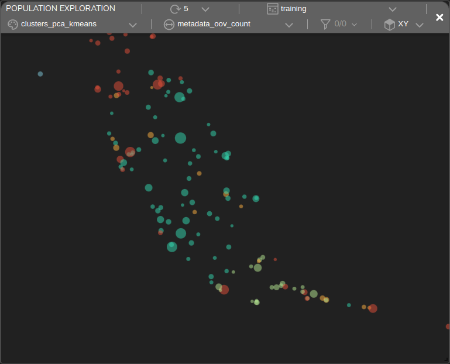

# Sentiment Analysis

## The IMDB Dataset

The **IMDB** dataset is one of the most popular sentiment analysis datasets. It contains multiple movie reviews, each annotated with either a `positive` or `negative` label.

In this example, a classifier model was built to predict positive and negative reviews.

### Text Preprocessing

To preprocess the text, first lowercase all words and remove any HTML residues and punctuations. Tokenize the words and feed them into an **Embedding** layer to embed all the tokens.

### Densely Connected Model

A straightforward approach to solving this problem is by using a densely connected model. The proposed [model](https://github.com/tensorleap/tensorleap/blob/master/examples/imdb/imdb/imdb/model_infer.py) is composed from a `Dense` layer followed by a `GlobalAveragePooling1D`.

Below is the model's block representation within our platform:

 (1).png>)

#### Training Metrics

During the training our platform collects various performance metrics and metadata that are presented interactively within a customizable Dashboard. This enables further performance and data analysis.\
After training the model for 5 epochs, the **accuracy** is **0.89** and the error **loss** is **0.26**. \
Visualization of the error loss / accuracy vs batch:

 (1).png>)

### Error Analysis

#### Population Exploration

The plot below is a **population exploration** plot. It represents a samples' similarity map based on the model's latent space, built using the extracted features from the trained model.

The samples shown below were taken from the **training set** and are colored based on their **ground truth** class. The dot's size represents the model's error loss for that specific sample. We can see that there is a clear separation of the samples based on their classes.There are also failing samples (large dots).

.png>)

#### Sample Analysis

The Tensorleap platform provides us with a way to further explore the model's response to specific data samples.

For example, performing **Sample Analysis** of one of the failing samples shows a **false-positive** prediction made by the model, with a heat-map overlay that scores the significance of each word to the `positive` prediction:

 (1).png>)

The heat-map highlighted words such as "**brilliant**", "**entertaining**", "**masterpiece**" which indeed translates positively. But when we review their context, we get "**mildly entertaining**", "**not... brilliant**", and "**masterpiece because of sympathy**", which resonates as negative.

The dense model makes its prediction using a single word context, which can lead to inaccurate sentiment analysis. To improve upon this, next we will evaluate a separate convolutional model.

### Convolutional Neural Network (CNN)

Our new model uses three convolutional blocks in place of the previously used dense layer, in order to capture a wider context and improve performance.

Below is the CNN model represented as block layers within our platform:

.png>)

After training the model for 3 epochs, its validation **accuracy** is **0.89** and the error **loss** is **0.28**.

Below is a visualization of the error loss / accuracy vs batch:

.png>)

#### Sample Analysis

Running **Sample Analysis** on the same sample, now with the new CNN model, results in a 67% improvement in the error loss. Below are the heat-maps correlated with the `positive` and `negative` outputs:

 (1).png>) .png>)

As expected, the convolutional model has a much wider context window, which results in the attention being spread over longer phrases. One result of this change is that "**entertaining**" is no longer an indication of a positive sentiment. In fact, the bigram "**entertaining mildly**" is now an indicator of a `negative` sentiment.

#### Data Exploration

The Tensorleap's Dashboard enables you to see how your data is distributed across various features. Below is a dashboard showing 5 histogram vs loss of informative features:

 (1).png>)

Different correlation insights from this visualization:

- `length` - the shorter the review, the higher the loss.
- `out-of-vocabulary` - the more out-of-vocabulary words a review has, the higher its loss.
- `subjectiveness` - the more subjective the review is, the lower the loss.
- `score confidence` - the more confident a review is (i.e. highly negative or positive), the lower the loss.
- `polarity` - an external (TextBlob) polarity analysis shows that sentences with neutral polarity have higher loss.

#### Unsupervised Clustering

Tensorleap's platform provides an unsupervised clustering of samples based on their similarities.

In our use-case we can see that this clustering technique was able to group together samples with common features. For example, in this Population Exploration plot, each cluster is colored, while the size of the dot represents the number of out-of-vector words within each sample:

The green cluster is mainly composed of examples with high OOV words. Other clusters, as the light blue, have fewer samples with high OOV count. Focused view on each of these clusters:

 

## Summary

The **Tensorleap** platform provides powerful tools for analyzing and understanding deep learning models. In this example, we presented only a few examples of the types of insights that can be gained using the platform.&#x20;
