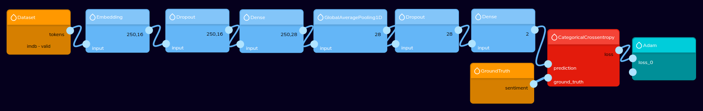
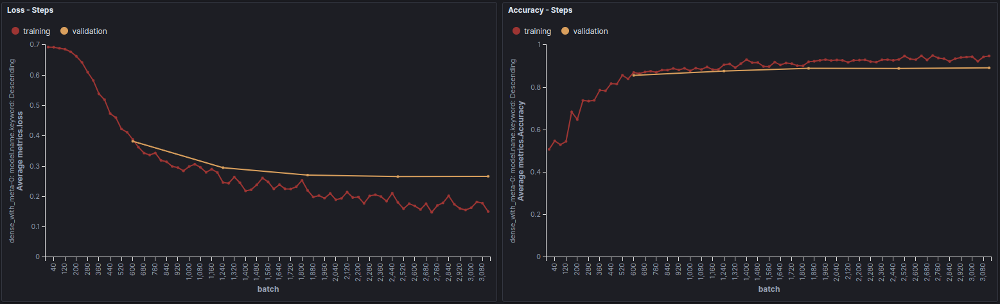
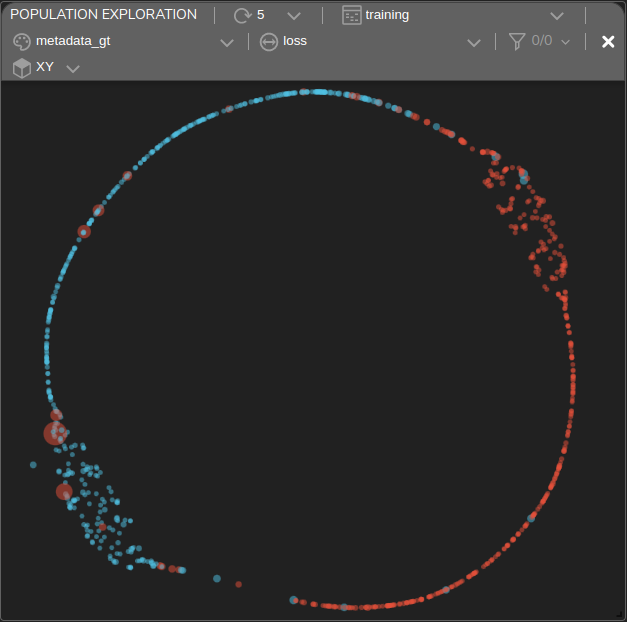
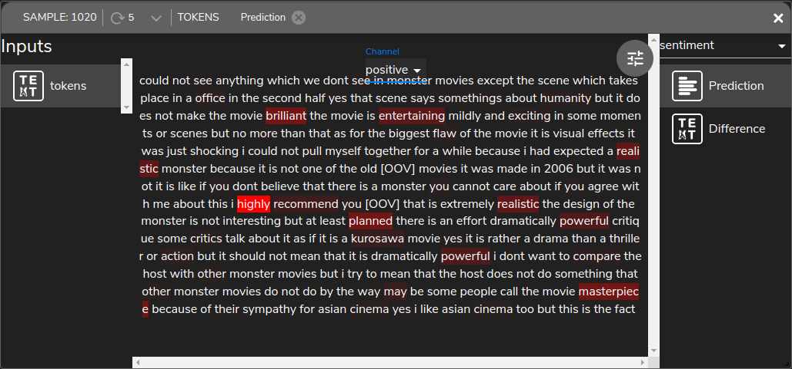
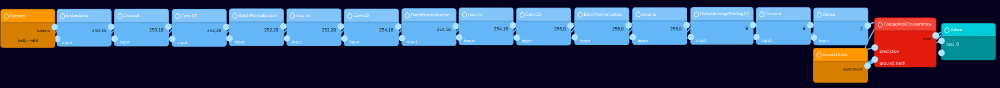
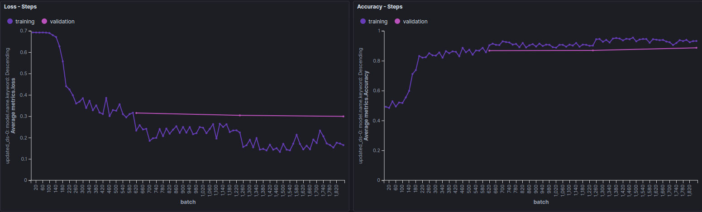
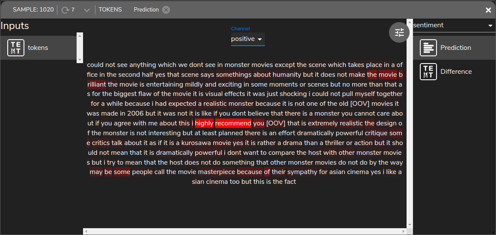
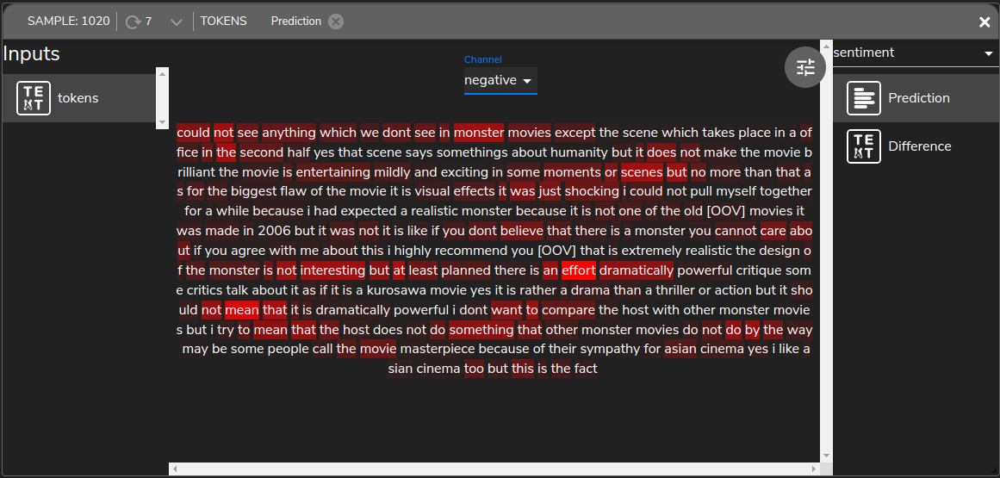
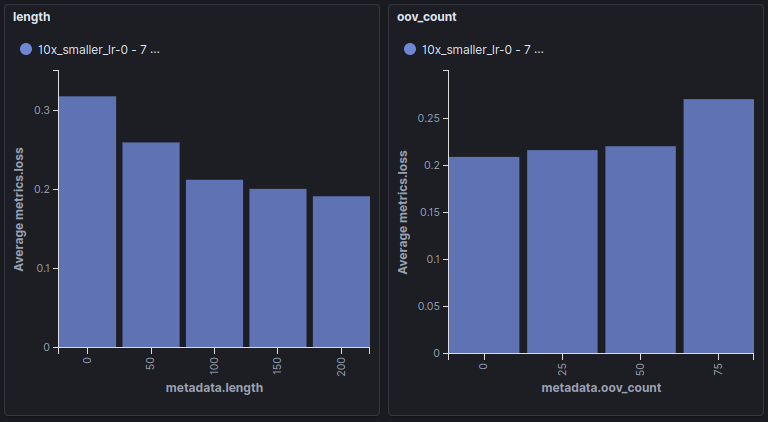

# IMDB

#### The IMDB dataset

The `IMDB` dataset is one of the most popular sentiment analysis datasets.
It contains multiple movie reviews, each annotated with a "positive" or a "negative" label.

#### Preprocessing

First, we use a [Tokenizer](https://github.com/tensorleap/tensorleap/blob/master/examples/imdb/imdb/imdb/utils.py) 
that removes html residues, punctuation, and lowercase all samples.
This tokenizer is then fed to a learnt `Embedding layer` to embed all the tokens.

### Densely connected model

#### Model introduction

A straight forward approach to solving this problem is by using a densely connected model. Our
[architecture](https://github.com/tensorleap/tensorleap/blob/master/examples/imdb/imdb/imdb/model_infer.py)
is composed from a `Dense` layer followed by a `GlobalAveragePooling1D`.

We train our model for 5 epochs and log the `CategoricalCrossEntropy` loss and the `Accuracy` metric:

Our final accuracy is 0.89 and our loss is 0.27.

#### Error analysis

To explorer the model's performance we visualize the latent space represntation using  `Tensorleap's Analyzer`, 
which embedds the dataset sample's in a model-based 3D space. 

Here, each sample is colored according to its GT value, and its size scales with loss.
Using Tensorleap's `Sample Analysis` we can analyze the samples that led to a high loss.

This example, of a specific false-positive sample, overlays a heatmap that scores the significance of each word to the
`positive` prediction made by the model. 

Since the dense model makes its prediction using a single word context, it considers single words, such as
**entertaining** or **masterpiece** as an indication for a **positive** sentiment. However, it ignores their context,
and therefore misses that its only **mildly entertaining** or a **masterpiece because of sympathy.**
To improve upon this we'll evaluate a second, convulutional model.

### CNN

Our new model aims to fix the missing context by replacing the dense layer with 3 convulutional blocks,
which should help in capturing a wider context.

We first train the model for 3 epochs to get an accuracy of 0.89 and a loss of 0.28 

Following the same process, we can examine the same sample, which result in a much lower loss now:

As expected, the convulutional model has a much wider context window, which results in the attention being
spread over longer phrases. One result of this change is that **entertaining** is no longer an indication of a positive sentiment.
In fact, the bi-gram "entertaining mildly" is now an indicator of a negative sentiment:

#### Data exploration

We can see how our data is distributed on various features of the input. Here, we present the `length` and
`out-of-vocubulary` counts vs. training set loss. We see that on average, the shorter the review, and the more
out-of-vocabulary words there are, the higher the loss. This is to be expected since both of these result in a less
informative input to the network.

fd

