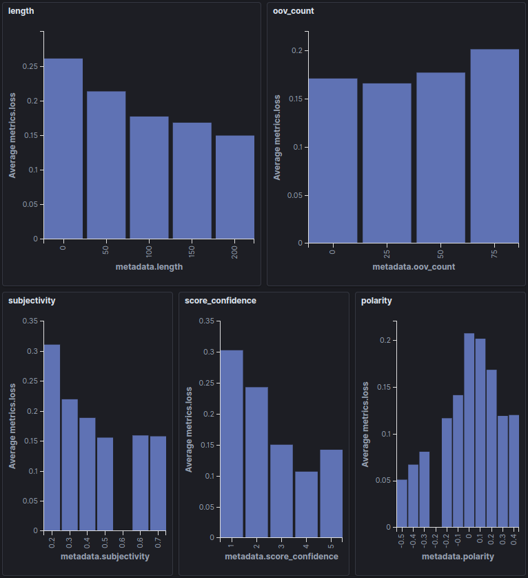

# IMDB

## The IMDB dataset

The `IMDB` dataset is one of the most popular sentiment analysis datasets.
It contains multiple movie reviews, each annotated with a "positive" or a "negative" label.

In this example, we build a classifier model to predict positive and negative reviews.

## Preprocessing

First, we use a [Tokenizer](https://github.com/tensorleap/tensorleap/blob/master/examples/imdb/imdb/imdb/utils.py) 
that removes HTML residues, punctuation, and lowercase  samples.
This tokenizer is then fed to a learned `Embedding layer` to embed all the tokens.

## Densely Connected Model

### Model Introduction

A straightforward approach to solving this problem is by using a densely connected model. Our
[architecture](https://github.com/tensorleap/tensorleap/blob/master/examples/imdb/imdb/imdb/model_infer.py)
is composed from a `Dense` layer followed by a `GlobalAveragePooling1D`.

We train our model for 5 epochs and log the `CategoricalCrossEntropy` loss and the `Accuracy` metric.

Our final accuracy is 0.89 and our loss is 0.27.

### Error Analysis 

To explore the model's performance, we visualize the latent space representation using  `Tensorleap's Analyzer`, 
which embeds the dataset samples in a model-based 3D space.    

Here, each sample is colored according to its GT value, and its size scales with loss.
Using Tensorleap's `Sample Analysis`, we can analyze the samples that led to a high loss.

This example, of a specific false-positive sample, overlays a heatmap that scores the significance of each word to the
`positive` prediction made by the model. 

Since the dense model makes its prediction using a single word context, it considers single words, such as
**entertaining** or **masterpiece** as an indication for a **positive** sentiment. However, it ignores their context,
and therefore misses that its only **mildly entertaining** or a **masterpiece because of sympathy.**
To improve upon this, we'll evaluate a separate convolutional model.

## CNN

Our new model aims to fix the missing context by replacing the dense layer with 3 convolutional blocks,
which should help in capturing a wider context.

We first train the model for 3 epochs to get an accuracy of 0.89 and a loss of 0.28.

Following the process we followed with the earlier model, we examine the same sample, which result in a 67% loss reduction.

As expected, the convolutional model has a much wider context window, which results in the attention being
spread over longer phrases. One result of this change is that **entertaining** is no longer an indication of a positive sentiment.
In fact, the bigram **entertaining mildly** is now an indicator of a negative sentiment.

### Data Exploration

Using Tensorleap's dashboard, we can see how our data is distributed across various features.
Here, we've selected 5 informative features and plotted their histogram vs. the loss:

- `length` - the shorter the review, the higher the loss.  
- `out-of-vocabulary` - the more out-of-vocabulary words a review has, the higher its loss.  
- `subjectiveness` - the more subjective the review is, the lower the loss.  
- `score confindence` - the more confident a review is (i.e. highly negative or positive), the lower the loss.  
- `polarity` - an external (TextBlob) polarity analysis shows that sentences with neutral polarity have higher loss.  

Finally, we can see that `Tensorleap's` unsupervised clustering is able to group together meaningful examples.

    

In this example, colors represent Tensorleap's clustering and size the amount of Out-of-vocabulary (OOV) words. We see that the green cluster is mainly composed of examples with high OOV words. Other clusters, as the light blue, have fewer samples with high OOV count.

**Tensorleap models of the images**

Dense: (dense_v5, short_train, dense_with_meta)  
Conv: (10x_smaller_lr, updated_ds, normal_lr, arranged)