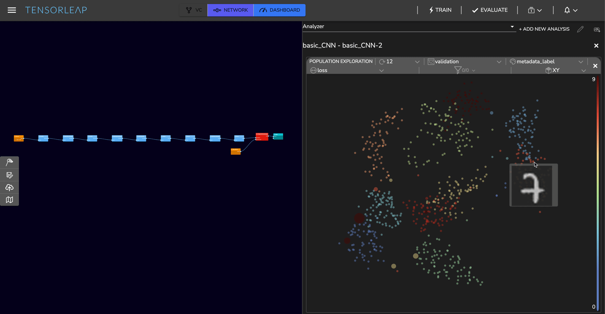
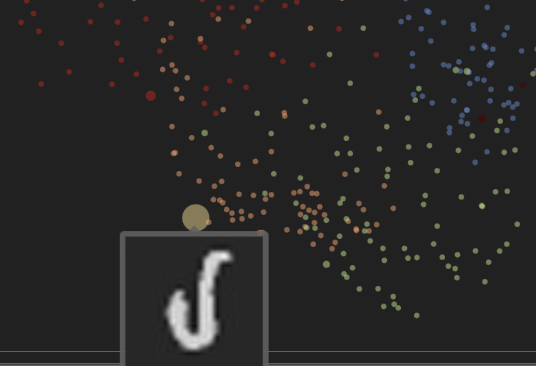
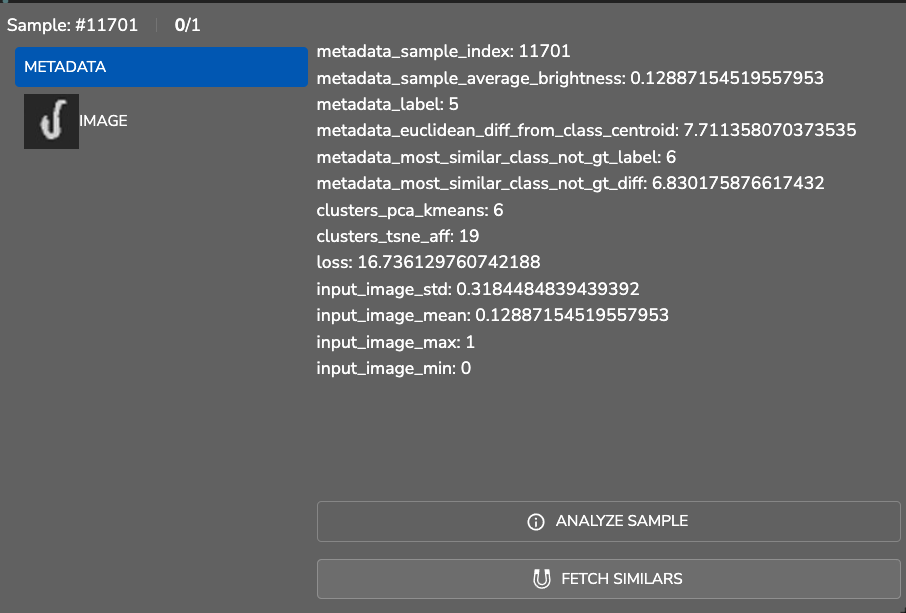

# Image Analysis

## The MNIST Dataset

In this example, we used the [**MNIST dataset**](http://yann.lecun.com/exdb/mnist/) (handwritten digits) to train a convolutional neural network (CNN) for image classification, and reached a validation accuracy of \~0.98 on our trained model.

### Population Exploration <a href="#population-exploration" id="population-exploration"></a>

Below is a **population exploration** plot. It represents a samples' similarity map based on the model's latent space, built using the extracted features of the trained model.

#### Training Set:

The samples shown below were taken from the **training set** and are colored based on their **ground truth** class. The dot's size represents the model's error loss for that specific sample. We can see that there is a clear separation of the samples based on their classes.


#### Validation Set:

The plot below is a similarity map within the **validation set** and we can see that there is still a nice separation, but there are quite a few samples with higher error loss (larger dot size). Interestingly, those false predictions are located within clusters of classes different from their **ground truth** class.

 (1).png>)

#### Similar Classes

In the visualization below we can see that the samples from class **7** _(peach-colored)_ and class **1** _(light-blue)_ are relatively close to each other. This makes sense since the digit **7** is visually similar to the digit **1**.



### Error Analysis <a href="#error-analysis" id="error-analysis"></a>

The dot's size in the visualization below represents the sample's loss. The selected sample is a challenging one, and we can also see that it has a relatively high loss. The sample's metadata shown on the right panel shows a distance of 6.83 to class `6` and 7.71 to the ground truth - class `5,`and indeed prediction was class `6`.

 

### Sample Analysis <a href="#sample-analysis" id="sample-analysis"></a>

The Tensorleap platform provides a way to further explore the model's response to specific data samples. For example, from the results below, we can see that the model's prediction was **9** while the ground truth is **8**. Additionally, we can use the heat map to see which features of the data contributed to each of the output classes.


### Fetch Similars <a href="#fetch-similars" id="fetch-similars"></a>

As explained, Tensorleap tracks how each learned feature responds to each sample. This allows finding samples that the model considers similar, as they _activate_ similar learned features.

This functionality also allows to automatically find **candidates for labeling**, detect **ambiguities** in the data and **mislabeled** samples.&#x20;

#### Fetch Similars to a Sample - Example

In the example below we ran a **Fetch Similars** operation to find similar samples to the sample . The result is a cluster of similar samples:

 (2).png>)  (1) (1) (1) (1) (1) (1).png>)

#### Example - Investigating the "Closed" 4 Digit

The MNIST dataset includes samples of the digit 4 written in two ways:  and . \
Running the Fetch Similars operation to find samples that are similar to  returns similar samples with presented heat maps that highlight the features that define these similarities.

 (1) (1) (1) (1) (1).png>)

In the 4 digit class the majority of the samples are written in the open form . The operation detected four samples that are similar to the closed form , while the other samples are mostly the digit `9`. This provides us with useful insights about the model and data and how to improve them. For example, we can:

- Separate the 4 class into two classes - open and closed digits.
- Enrich the data with additional samples of closed digits.
- Remove the closed digits from the dataset and support only the open form.

Similar analysis can be done for the two ways of writing the digit seven:  and .&#x20;

### Metrics Analysis <a href="#results-analysis" id="results-analysis"></a>

The Tensorleap Dashboard allows users to visualize the training progress and performance metrics of their models. Additionally, users can explore correlations and trends between various metadata to gain insights into their data.

**Average Euclidean Distance Metadata vs Average Loss**

For each class, its **mean image** is calculated (28x28) by averaging each pixel. For each sample, its Euclidean distance from the **mean image** of its class is calculated and set as its metadata.

The Dashboard allows us to visualize and investigate each metadata interactively. The visualization below shows the average error loss per class, vs the Euclidean distance.

.png>)

This plot reveals a strong correlation between the Euclidean distance and the average loss - as the Euclidean distance increases, the loss increases with it. This is expected, as the model is less capable of generalizing samples with high irregularities.

**Loss and Accuracy Visualizations**

During training, metrics are collected and presented in the Dashboard.\
For example, a visualization of the model's Loss (left) and Accuracy(right) vs batches:

 (1).png>)

As we can see, the model convergences well and achieves an accuracy of \~0.98 on the **validation** set.

## Summary

The **Tensorleap** platform provides powerful tools for analyzing and understanding deep learning models. In this example, we presented only a few examples of the types of insights that can be gained using the platform.&#x20;


# Getting Started with Tensorleap Project

This quick start guide will walk you through the steps to get started with this example repository project.

## Prerequisites

Before you begin, ensure that you have the following prerequisites installed:

- **[Python](https://www.python.org/)** (version 3.7 or higher).
- **[Poetry](https://python-poetry.org/)**.
- **[Tensorleap](https://tensorleap.ai/)** platform access. To request a free trial click [here](https://meetings.hubspot.com/esmus/free-trial).
- **[Tensorleap CLI](https://github.com/tensorleap/leap-cli)**.
- 
## Tensorleap **CLI Installation**

with `curl`:

```
curl -s https://raw.githubusercontent.com/tensorleap/leap-cli/master/install.sh | bash
```

## Tensorleap CLI Usage

### Tensorleap **Login**

To login to Tensorleap:

```
tensorleap auth login [api key] [api url].
```

- API Key is your Tensorleap token (see how to generate a CLI token in the section below).
- API URL is your Tensorleap environment URL: https://api.CLIENT_NAME.tensorleap.ai/api/v2

<br>

**How To Generate CLI Token from the UI**

1. Login to the platform in 'CLIENT_NAME.tensorleap.ai'
2. Scroll down to the bottom of the **Resources Management** page, then click `GENERATE CLI TOKEN` in the bottom-left corner.
3. Once a CLI token is generated, just copy the whole text and paste it into your shell.


## Tensorleap **Project Deployment**

To deploy your local changes:

```
leap project push
```

### **Tensorleap files**

Tensorleap files in the repository include `leap_binder.py` and `leap.yaml`. The files consist of the  required configurations to make the code integrate with the Tensorleap engine:

**leap.yaml**

leap.yaml file is configured to a dataset in your Tensorleap environment and is synced to the dataset saved in the environment.

For any additional file being used, we add its path under `include` parameter:

```
include:
    - leap_binder.py
    - mnist/configs.py
    - [...]
```

**leap_binder.py file**

`leap_binder.py` configures all binding functions used to bind to Tensorleap engine. These are the functions used to evaluate and train the model, visualize the variables, and enrich the analysis with external metadata variables

## Testing

To test the system we can run `leap_test.py` file using poetry:

```
poetry run test
```

This file will execute several tests on leap_binder.py script to assert that the implemented binding functions: preprocess, encoders,  metadata, etc.,  run smoothly.

*For further explanation please refer to the [docs](https://docs.tensorleap.ai/)*
