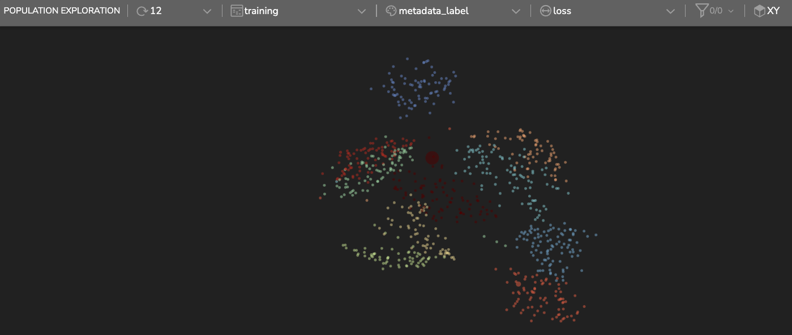
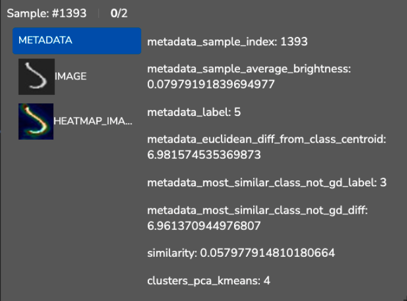
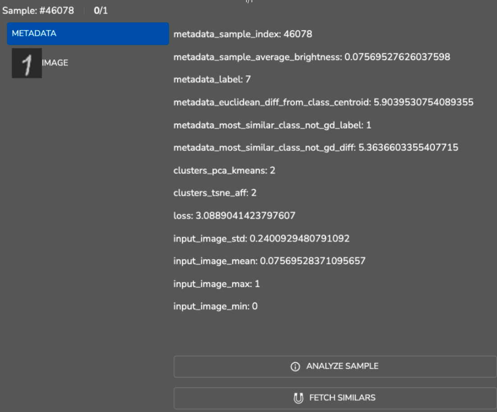
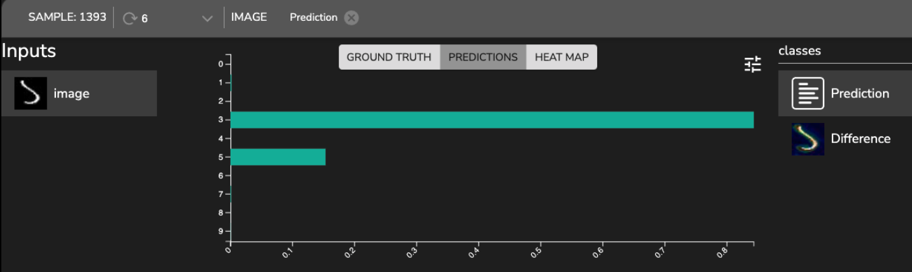
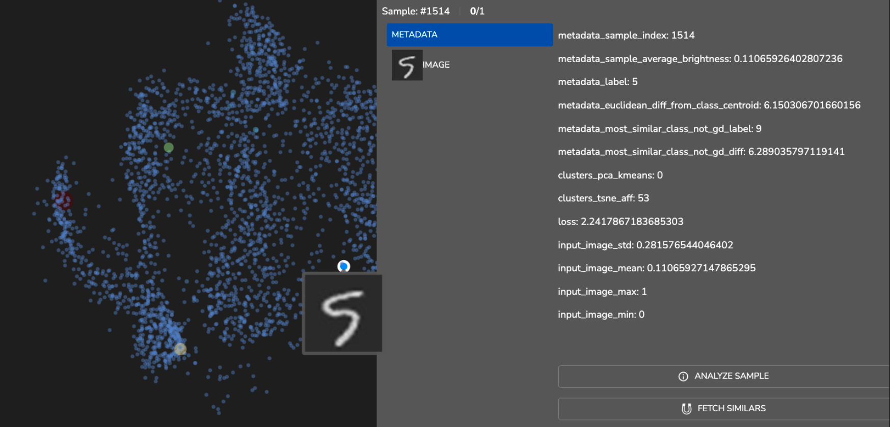
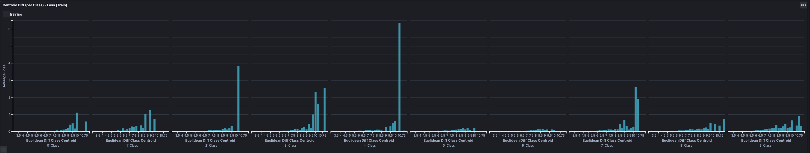
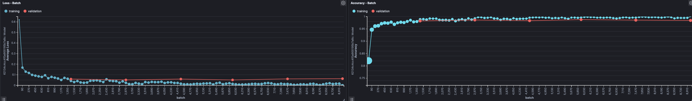

# MNIST

We show an example of building a cnn network trained on MNIST dataset. 

The MNIST database (Modified National Institute of Standards and Technology database) is a database of handwritten digits often used for training various image processing systems. 

In this example, we integrate the MNIST dataset into Tensorleap (TL) and build a simple classification model. 
We demonstrate how we can analysis the model predictions using TL.

The model achieved accuracy of 0.98~. 

## Population Exploration

This embedding space is a representation based on the network's extracted features. The samples are from the training set.

We can see that there is a nice separation of the samples based on their classes.
The samples are colored based on their GT class and the dot size is based on the network's error loss. 

Now, we plot the validation set:

There is still a nice separation, however, with more high error loss samples. 
Interesting, those false predictions (larger dot size) are located within clusters of classes which are different than their GT.  

In the digits image space there are some classes which are close to each other. For example, class 1 and class 7 tends to look alike. We can see that from the population exploration plot below, these classes samples are closer 
to each other and there are some false prediction between the samples on the edge. Samples in light blue are from class 1 and the peach colored are from 7.

# Error Analysis

 

**Sample 11701:** Prediction: 6, GT: 5

- The loss on that sample is relatively higher than the other samples. From metadata, we get that the sample is closer to 6 class (6.83) than its GT - 5 (7.71). That is why the model predicted the sample to be 6. 

### Results Analysis

By using TL Dashboard functionality, we can plot the training progress, visualize the metadata vs performance to find correlations and trends.  

**Average Euclidean Difference Metadata and Average Loss**

We plot the samples' average loss vs the samples' Euclidean difference metadata (per class). We expect that for samples that are further than their class average examplar, the loss will be higher. Consequently, the network will be less capable of generalizing on these deviated samples.

- We see the trend in line with our expectations, as the Euclidean difference increases, the average loss increases. 

- The Euclidean difference from the class examplar is calculated as follows: 
  - We extract the class centroid per class: we take all images with respect to their class and calculate an average per pixel. The output will be a 28x28 image.     
  - Per sample, we calculate the Euclidean difference from its class centroid.

**Loss and Accuracy Plots**

We plot the model Loss Accuracy for training and validation sets during training iterations:

There is a nice convergence of the model, achieving accuracy of ~0.98 on validation set.  

We have shown a few examples of the model analysis and insights we can gain using TL. Nevertheless, we only begin to scratch the surface with the potential capabilities and wisdom we can achieve using the platform. For further examples, please refer to our additional examples and tutorials. 

