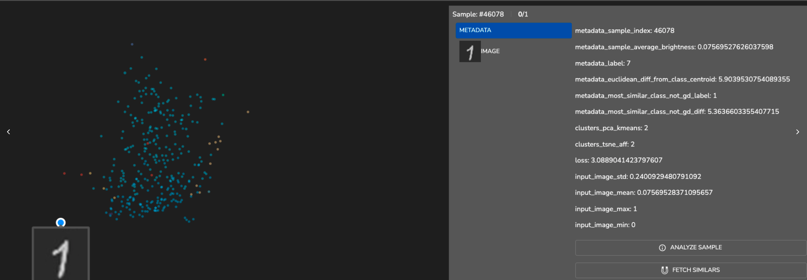
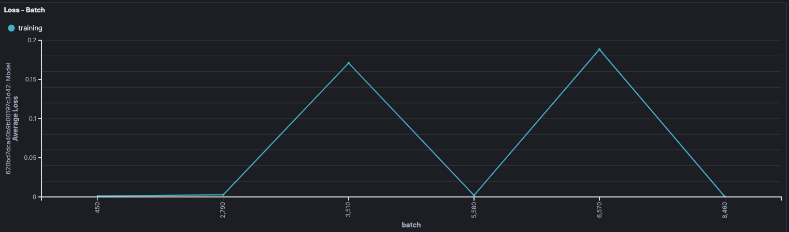

# MNIST

We show an example of building a cnn network trained on MNIST dataset.

This example includes the following steps:

- Loading MNIST dataset and do some very basic preprocessing
- Building a CNN network using tensorflow keras modules
- Sanity Check: test the (untrained) model prediction on one sample
- setting up Leap env
- integrate the model and dataset into the TL.

The model achieved accuracy of 0.98~. 

In the digits image space there are some classes which are very close to each other. For example, class 1 and class 7 tends to look alike. We can see that from the population exploration plot that these samples are closer 
to each other and there are some false prediction between the samples on the edge.

For instance, samples in light blue are from class 1 and the peach colored are from 7.

# Error Analysis

The following samples are the model's false classifications.

- **Sample 46078:** Prediction: 1, GT: 7

- One can see that the sample is closer to 1 class than its GT - 7, from the metadata (most similar class which isn't the GT) and from eyeball.

- **Sample 1514:** Prediction: 9, GT: 5

- The most similar class which isn't the GT metadata is 9 with a difference of 6.28 when the difference of the sample from its GT representative - 5 is 6.15.

- **Sample 1393:** Prediction: 3, GT: 5

- Perhaps it's not straightforward but the metadata does support the model's prediction. We can see that the image is closer to 3 than to 5.

- There is a confidence probability for the sample to be 5 as well.

### Average Euclidean difference and Average Loss

- When the euclidean difference of a sample from its class centroid, increases, the average loss increases. 

- From the chart of class 4, we can see that after the peak in the bin of 10 difference there is a drop. Let's examine that sample:

Looking from the plot of loss per batch we see the loss jumps during training from higher loss to zero. We see how the net is overfitting on that sample.

