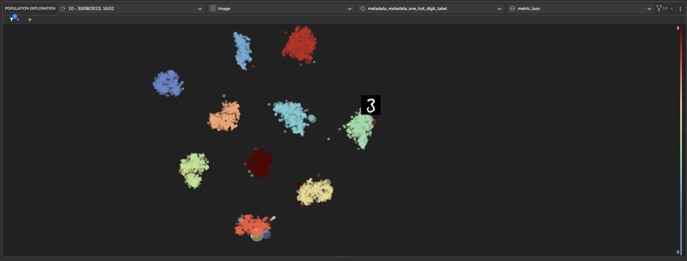

# The MNIST Dataset

In this example, we used the [**MNIST dataset**](http://yann.lecun.com/exdb/mnist/) (handwritten digits) to train a convolutional neural network (CNN) for image classification, and reached a validation accuracy of \~0.98 on our trained model.

### Population Exploration <a href="#population-exploration" id="population-exploration"></a>

Below is a **population exploration** plot. It represents a samples' similarity map based on the model's latent space, built using the extracted features of the trained model.

#### Training Set:

The samples shown below were taken from the **training set** and are colored based on their **ground truth** class. The dot's size represents the model's error loss for that specific sample. We can see that there is a clear separation of the samples based on their classes.




### Error Analysis <a href="#error-analysis" id="error-analysis"></a>

The true class label for this sample is `2`, but the model's prediction assigns it to `1`.
Furthermore, the visualization shows that this sample appears to be more closely related to samples from class `1` 
(indicated by the light blue color) rather than samples from class `2` (indicated by the turquoise color).


### Sample Analysis <a href="#sample-analysis" id="sample-analysis"></a>

The Tensorleap platform provides a way to further explore the model's response to specific data samples. For example, from the results below, we can see that the model's prediction was **9** while the ground truth is **8**. 


.............

### Loss analysis

In the image below we can see a sample with true class label of `7`, but the model's prediction assigns it to `4`.
When examining the loss analysis feature, we can identify specific regions within the image that contribute to the 
higher loss, thereby causing the model's prediction to be inaccurate.


### Fetch Similars <a href="#fetch-similars" id="fetch-similars"></a>

As explained, Tensorleap tracks how each learned feature responds to each sample. This allows finding samples that the model considers similar, as they _activate_ similar learned features.
This functionality also allows to automatically find **candidates for labeling**, detect **ambiguities** in the data and **mislabeled** samples.&#x20;
In the example below we ran a **Fetch Similars** operation to find similar samples to the sample . The result is a cluster of similar samples:


### Metrics Analysis <a href="#results-analysis" id="results-analysis"></a>

The Tensorleap Dashboard allows users to visualize the training progress and performance metrics of their models. Additionally, users can explore correlations and trends between various metadata to gain insights into their data.
The Dashboard allows us to visualize and investigate each metadata interactively. The visualization below shows the average error loss per class separate into two groups-even and odd.


## Summary

The **Tensorleap** platform provides powerful tools for analyzing and understanding deep learning models. In this example, we presented only a few examples of the types of insights that can be gained using the platform.&#x20;


# Getting Started with Tensorleap Project

This quick start guide will walk you through the steps to get started with this example repository project.

## Prerequisites

Before you begin, ensure that you have the following prerequisites installed:

- **[Python](https://www.python.org/)** (version 3.7 or higher).
- **[Poetry](https://python-poetry.org/)**.
- **[Tensorleap](https://tensorleap.ai/)** platform access. To request a free trial click [here](https://meetings.hubspot.com/esmus/free-trial).
- **[Tensorleap CLI](https://github.com/tensorleap/leap-cli)**.

## Tensorleap **CLI Installation**

with `curl`:

```
curl -s https://raw.githubusercontent.com/tensorleap/leap-cli/master/install.sh | bash
```

## Tensorleap CLI Usage

### Tensorleap **Login**

To login to Tensorleap:

```
tensorleap auth login [api key] [api url].
```

- API Key is your Tensorleap token (see how to generate a CLI token in the section below).
- API URL is your Tensorleap environment URL: https://api.CLIENT_NAME.tensorleap.ai/api/v2

<br>

**How To Generate CLI Token from the UI**

1. Login to the platform in 'CLIENT_NAME.tensorleap.ai'
2. Scroll down to the bottom of the **Resources Management** page, then click `GENERATE CLI TOKEN` in the bottom-left corner.
3. Once a CLI token is generated, just copy the whole text and paste it into your shell.


## Tensorleap **Project Deployment**

To deploy your local changes:

```
leap project push
```

### **Tensorleap files**

Tensorleap files in the repository include `leap_binder.py` and `leap.yaml`. The files consist of the  required configurations to make the code integrate with the Tensorleap engine:

**leap.yaml**

leap.yaml file is configured to a dataset in your Tensorleap environment and is synced to the dataset saved in the environment.

For any additional file being used, we add its path under `include` parameter:

```
include:
    - leap_binder.py
    - mnist/configs.py
    - [...]
```

**leap_binder.py file**

`leap_binder.py` configures all binding functions used to bind to Tensorleap engine. These are the functions used to evaluate and train the model, visualize the variables, and enrich the analysis with external metadata variables

## Testing

To test the system we can run `leap_test.py` file using poetry:

```
poetry run test
```

This file will execute several tests on leap_binder.py script to assert that the implemented binding functions: preprocess, encoders,  metadata, etc.,  run smoothly.

*For further explanation please refer to the [docs](https://docs.tensorleap.ai/)*
