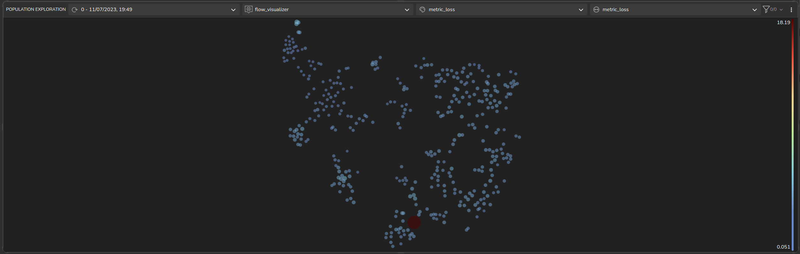
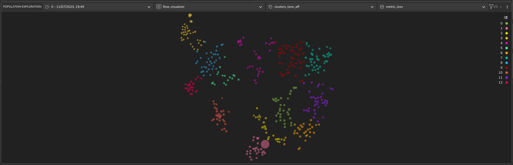
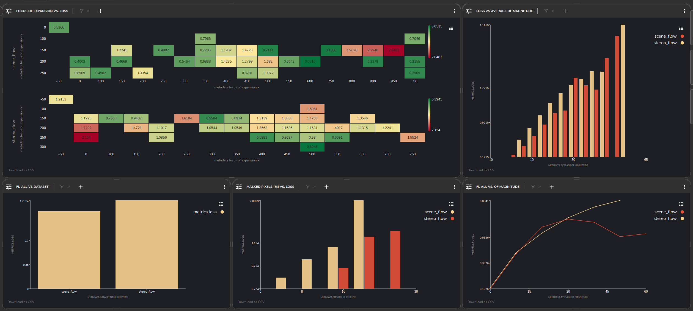

# RAFT optical flow
This project evaluates and analyzes the [RAFT (Recurrent All-Pairs Field Transforms)](https://github.com/princeton-vl/RAFT)
optical flow model on the [KITTI](https://www.cvlibs.net/datasets/kitti/) dataset. RAFT is a state-of-the-art model that
uses an all-pairs recurrent approach to approximate optical flow solutions. Optical flow is the pattern of apparent 
motion of objects, surfaces, and edges in a visual scene caused by the relative motion between the observer and the 
scene. RAFT estimates these motion patterns by calculating the displacement (flow) of pixels between consecutive frames
of an image sequence. This project has the potential to advance applications like object tracking and autonomous driving
through improved optical flow estimation and contribute to the broader field of computer vision.

# Latent Space and Clusters

After inferring RAFT on two KITTI subsets (scene-flow and stereo-flow) using the Tensorleap platform we get a
visualization of our latent space.



Coloring the latent space according to our TSNE clusters we get several distinct clusters:



Going through some of the clusters we can see that we have clusters that contain:

- image pairs where the car takes a left turn:  


- image pairs where the car takes a right turn:


- image pairs where the car has no ego motion:


# Dashboards



In the Dashboard panel we can see the correlation of various metadata with the loss and FL metrics:

- The focus of expnasion location vs. the loss (high error when taking turns)
- Average Optical Flow magnitude vs. loss/Fl-metric
- Subset Name vs. Loss
- Amount of max pixels vs. loss (more pixels masked - higher error)


## General
This quick start guide will walk you through the steps to get started with this example repository project.

**Prerequisites**

Before you begin, ensure that you have the following prerequisites installed:

- **[Python](https://www.python.org/)** (version 3.8 or higher)
- **[Poetry](https://python-poetry.org/)**

### Tensorleap **CLI Installation**

with `curl`:

```
curl -s <https://raw.githubusercontent.com/tensorleap/leap-cli/master/install.sh> | bash
```

with `wget`:

```
wget -q -O - <https://raw.githubusercontent.com/tensorleap/leap-cli/master/install.sh> | bash
```

CLI repository: https://github.com/tensorleap/leap-cli

### Tensorleap CLI Usage

#### Tensorleap **Login**
To allow connection to your Tensorleap platform via CLI you will have to authenticate and login.
To login to Tensorealp:

```
leap auth login [api key] [api url].
```

- API Key is your Tensorleap token (see how to generate a CLI token in the section below).
- API URL is your Tensorleap environment URL: CLIENT_NAME.tensorleap.ai

<br> 

**How To Generate CLI Token from the UI**

1. Login to the platform in 'CLIENT_NAME.tensorleap.ai'
2. Scroll down to the bottom of the **Resources Management** page, then click `GENERATE CLI TOKEN`  in the bottom-left corner.
3. Once a CLI token is generated, just copy the whole text and paste it into your shell:

```
leap auth login [api key] [api url]
```

### Tensorleap Dataset Deployment

To deploy your local changes:

```
leap code push
```

### **Tensorleap files**

Tensorleap files in the repository include `leap_binder.py` and `leap.yaml`. The files consist of the  required configurations to make the code integrate with the Tensorleap engine:

### **leap.yaml file**
leap.yaml file is configured to a dataset in your Tensorleap environment and is synced to the dataset saved in the environment.

For any additional file being used we add its path under `include` parameter:


```
include:
    - leap_binder.py
    - optical_flow_raft/data/preprocess.py
    - optical_flow_raft/utils/cloud_utils.py
    - optical_flow_raft/utils/flow_utils.py

```

### **leap_binder.py file**
`leap_binder.py` configure all binding functions used to bind to Tensorleap engine. These are the functions used to evaluate and train the model, visualize the variables, and enrich the analysis with external metadata variables

### Testing

To test the system we can run `leap_test.py` file using poetry:

```
poetry run test
```

This file will execute several tests on the `leap_binder.py` script to assert that the implemented binding functions: preprocess, encoders,  metadata, etc,  run smoothly.

*For further explanation please refer to the [docs](https://docs.tensorleap.ai/)*
