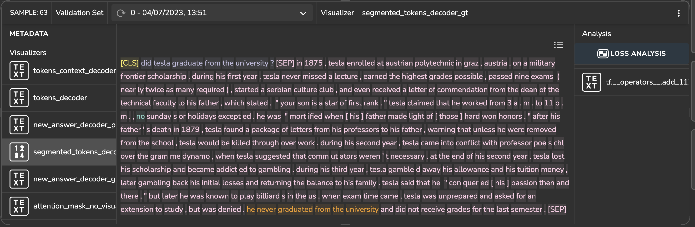

## Project Description
### Albert model with SQuAD dataset

This project implements the Albert algorithm using the [SQuAD](https://huggingface.co/datasets/squad) (Stanford Question Answering Dataset) for question
answering tasks.

### Population Exploration

Below is a population exploration plot. It represents a samples' similarity map based on the model's latent space,
built using the extracted features of the trained model.

It shows a visualization of the training and validation sets where we can see two distinct clusters. 
This means that there is a difference in their representation that might indicate some sort of imbalance.


#### *Detecting & Handling High Loss Clusters*
In Question Answering (QA), the "title" refers to the title of the passage from which the question is derived, one of
the titles in the dataset is ‘American Idol’.
Further analysis reveals that a cluster in samples related to ‘American Idol’ title, has a higher loss
(larger dot sizes).
At a glance, we can see that this cluster contains questions that relate to names of songs, 
such as “what was [singer’s name] first single?” or “what is the name of the song…?”.


It appears that the model did detect the correct answers. However, the prediction contains quotation marks while the
ground truth doesn’t.

#### *Detecting Unlabeled Clusters in the Latent Space*

Now, let’s look for additional clusters in our data using an unsupervised clustering algorithm on the model’s latent
space.
Upon examination of these clusters, we can see that clusters 13 and 20, located close to each other, contain answers 
relating to years and dates of events. Cluster 20 (left side image) includes primarily questions that require answers
related to years, 
such as “What year…?” where the answers are years represented in digits: “1943”, “1659” etc. 
Cluster 13 (right side image), includes questions that require answers related to dates and times, such as “When.. ?” 
and answers of the dates and times represented in text and digits: “early months of 1754”, “1 January 1926”, 
“20 december 1914”, “1990s” etc.

<div style="display: flex">
  
  
</div>

#### *Fetching similar samples*

Another approach to finding clusters using the model’s latent space is fetching similar samples to a selected sample.
It enables you to identify a cluster with an intrinsic property you want to investigate. 
By detecting this cluster, you can gain insights into how the model interprets this sample and, in general, retrieve 
clusters with more abstract patterns.

The figure below shows a Quantitative Questions and Answers cluster. We can see that the cluster which includes 
quantitative questions and answers contains questions such as “How many …?”, “How often…?”, “How much …?” and answers 
represented in digits and in words: “three”, “two”, “75%”, “50 million”, “many thousands”.


#### *Sample Loss Analysis*
In this section, we can see the results of a gradient-based explanatory algorithm to interpret what drives the model to 
make specific predictions. It is enables us to analyze which of the informative features contributes most 
to the loss function. We then generate a heatmap with these features that shows the relevant information.

Let’s analyze the following sample containing the question: “when did Beyonce release ‘formation’?”. The correct 
predicted answer is: “February 6, 2016”. We see that the tokens that had the most impact on the model’s prediction are:
‘when’, ‘one’, ‘day’, ‘before’. Also, the answer tokens:’ february’, ‘6’,’ 2016′.


#### *False / Ambiguous Labelings*

The figure below shows an example for illustrates inaccurate and mislabeled samples.
We can see a sample with the question (shown in purple): “Did Tesla graduate from the university?” The answer from the 
context is: “he never graduated from the university” (shown in orange). This was detected correctly by the model. 
However, the ground truth’s indexes refer to “no” (shown in green) in the sentence: “no Sundays or holidays…”. As in 
the above example, the indexes are incorrect and in an unrelated location to the question.



Such cases distort the model’s performance and negatively affect its fitting when penalizing the model on these samples.
We can solve these issues by changing the ground truth or by removing such samples.

## General
This quick start guide will walk you through the steps to get started with this example repository project.

**Prerequisites**

Before you begin, ensure that you have the following prerequisites installed:

- **[Python](https://www.python.org/)** (version 3.8 or higher)
- **[Poetry](https://python-poetry.org/)**

### Tensorleap **CLI Installation**

with `curl`:

```
curl -s <https://raw.githubusercontent.com/tensorleap/leap-cli/master/install.sh> | bash
```

with `wget`:

```
wget -q -O - <https://raw.githubusercontent.com/tensorleap/leap-cli/master/install.sh> | bash
```

CLI repository: https://github.com/tensorleap/leap-cli

### Tensorleap CLI Usage

#### Tensorleap **Login**
To allow connection to your Tensorleap platform via CLI you will have to authenticate and login.
To login to Tensorealp:

```
leap auth login [api key] [api url].
```

- API Key is your Tensorleap token (see how to generate a CLI token in the section below).
- API URL is your Tensorleap environment URL: CLIENT_NAME.tensorleap.ai

<br> 

**How To Generate CLI Token from the UI**

1. Login to the platform in 'CLIENT_NAME.tensorleap.ai'
2. Scroll down to the bottom of the **Resources Management** page, then click `GENERATE CLI TOKEN`  in the bottom-left corner.
3. Once a CLI token is generated, just copy the whole text and paste it into your shell:

```
leap auth login [api key] [api url]
```

### Tensorleap Dataset Deployment

To deploy your local changes:

```
leap code push
```

### **Tensorleap files**

Tensorleap files in the repository include `leap_binder.py` and `leap.yaml`. The files consist of the  required configurations to make the code integrate with the Tensorleap engine:

### **leap.yaml file**
leap.yaml file is configured to a dataset in your Tensorleap environment and is synced to the dataset saved in the environment.

For any additional file being used we add its path under `include` parameter:

```
include:
  - leap_binder.py
  - utils/decoders.py
  - utils/encoders.py
  - utils/loss.py
  - utils/metrices.py
  - utils/utils.py
  - project_config.py
```

### **leap_binder.py file**
`leap_binder.py` configure all binding functions used to bind to Tensorleap engine. These are the functions used to evaluate and train the model, visualize the variables, and enrich the analysis with external metadata variables

### Testing

To test the system we can run `leap_test.py` file using poetry:

```
poetry run test
```

This file will execute several tests on the `leap_binder.py` script to assert that the implemented binding functions: preprocess, encoders,  metadata, etc,  run smoothly.

*For further explanation please refer to the [docs](https://docs.tensorleap.ai/)*


